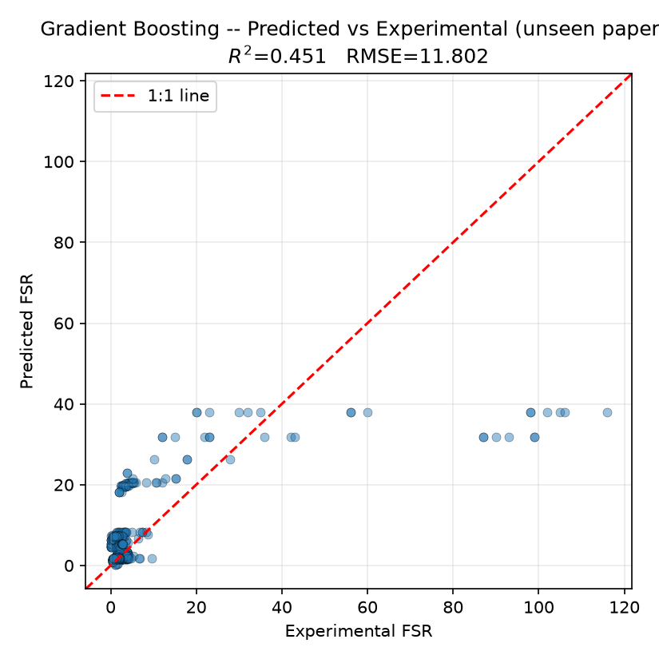
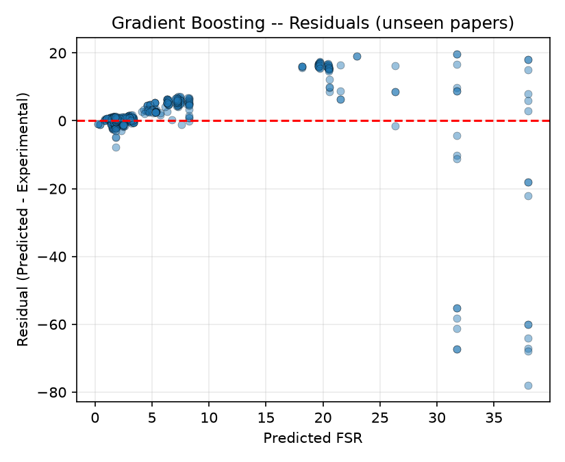
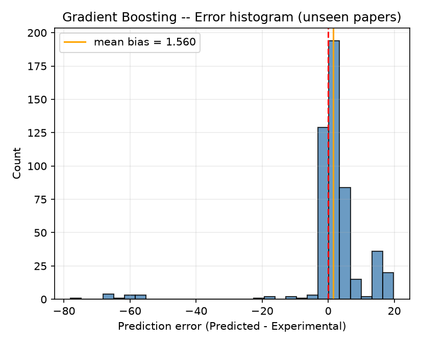
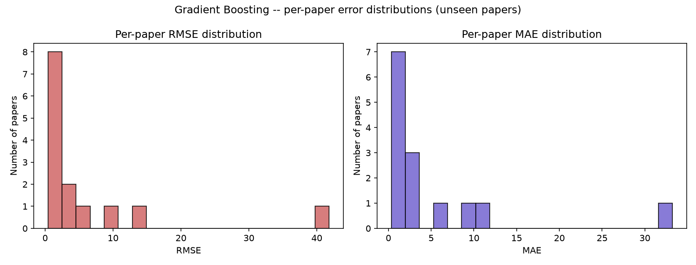
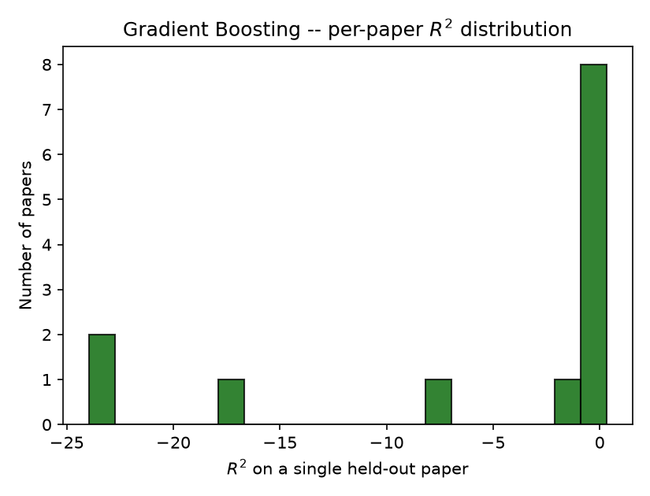
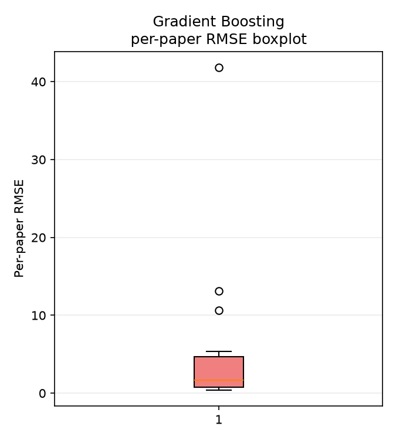
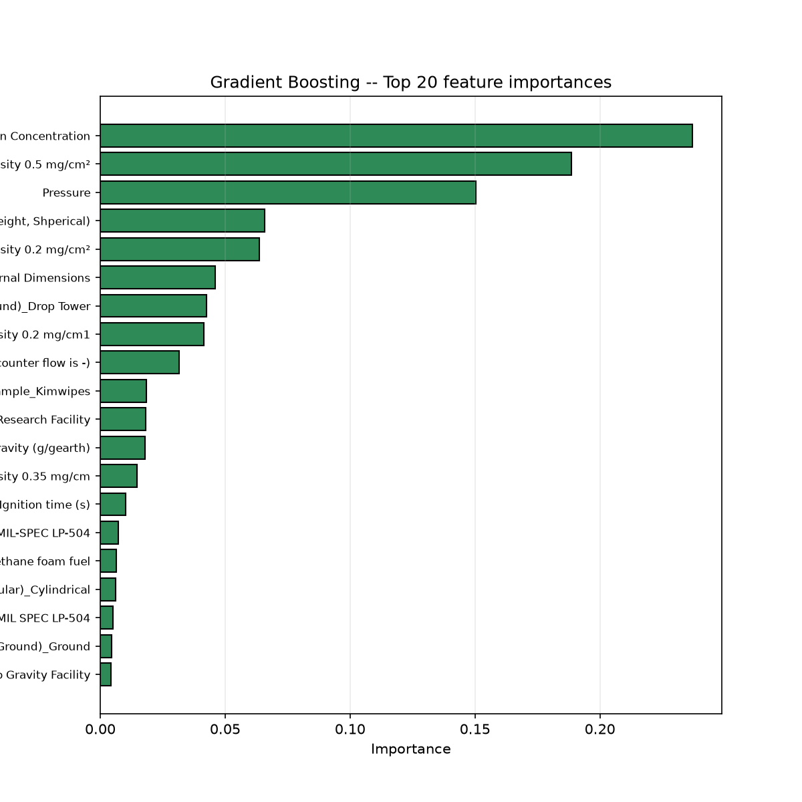
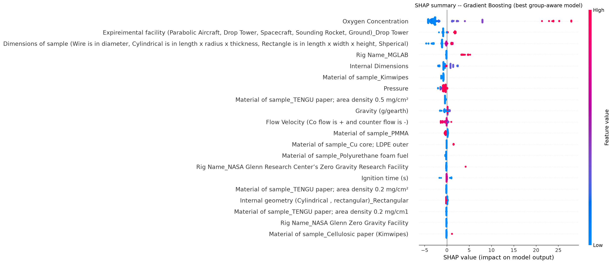
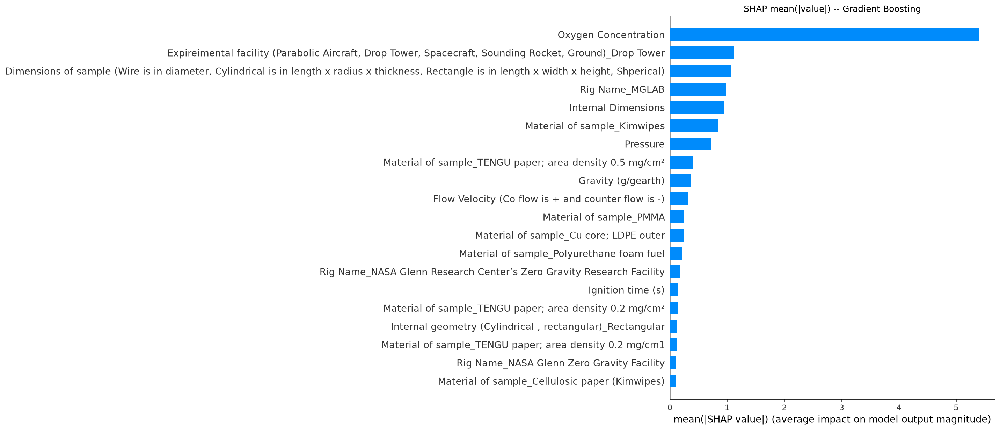

# Predicting Flame Spread Rate (FSR) in Microgravity Combustion
### A paper-aware (extrapolation-first) machine-learning study

**Models compared:** Decision Tree · Gradient Boosting · K-Nearest Neighbors
**Target:** Flame Spread Rate (FSR)
**Data:** `Microgravity_Database.xlsm` (sheet `Sheet2`)
**Code:** [`fsr_extrapolation_regression.py`](fsr_extrapolation_regression.py)
**Reproducibility:** `random_state = 42` everywhere; full console log in [`run_log.txt`](run_log.txt)

---

## 1. Executive summary

This study trains, tunes, evaluates and compares three regression models to predict the
**Flame Spread Rate (FSR)** of solid-fuel combustion experiments compiled from the
microgravity-combustion literature.

The defining design decision is that the scientific objective is **extrapolation**, not
interpolation: we want to predict FSR for **completely unseen papers / experimental
campaigns / rigs**, not merely fill in gaps between rows of a paper the model has already
partly seen. Because the database is a *literature aggregation* — a single paper typically
contributes dozens of highly-correlated rows — a naïve random train/test split leaks
paper-specific information into the test set and produces optimistic, scientifically
misleading metrics. We therefore evaluate every model with a **paper-aware (grouped)**
protocol where all rows of any given paper are kept entirely in train **or** entirely in
test, never both.

**Headline result (primary, group-aware / unseen papers):**

| Rank | Model | R² | RMSE | MAE | NRMSE |
|---|---|---|---|---|---|
| 1 | **KNN** | 0.519 | 11.05 | 5.62 | 1.92 |
| 2 | **Gradient Boosting** | 0.451 | 11.80 | 5.35 | 2.05 |
| 3 | **Decision Tree** | 0.346 | 12.88 | 6.00 | 2.23 |

**Best model by the tuning criterion (GroupKFold cross-validation RMSE): Gradient Boosting**
(CV RMSE = 12.90, the lowest of the three; see §8). The discrepancy between "lowest CV RMSE"
and "lowest held-out RMSE" is itself an important finding about how hard and variable
extrapolation is on this dataset (§11).

The **generalization gap** (group RMSE − random RMSE) is large and positive for all models —
between **+2.7 and +3.9 RMSE units** — confirming that the random-split numbers everyone is
tempted to report are substantially too optimistic.

---

## 2. The dataset

| Property | Value |
|---|---|
| Rows loaded from `Sheet2` | 5,118 |
| Rows with a valid numeric FSR (kept) | **2,605** |
| Rows removed (missing / non-numeric FSR) | 2,513 |
| Columns loaded | 23 |
| Detected target column | `FSR (Flame Spread Rate)` |
| Detected paper-grouping column | `Article (MLA)` |
| Unique papers | **69** |
| Numeric features used | 8 |
| Categorical features used | 6 |

**Samples per paper** (this is *why* paper-aware evaluation matters — papers are large,
correlated blocks):

| Statistic | Value |
|---|---|
| Mean | 37.75 |
| Median | 28.0 |
| Min | 4 |
| Max | 123 |
| Std | 31.7 |

The target itself is heavy-tailed (FSR ranges from ≈0 to ≈211 in the raw units of the
database, mean ≈9, median ≈2.6), which is why we report several complementary error metrics
(§7) rather than a single number.

---

## 3. End-to-end pipeline overview

```
Excel (two-row header)
   │  load_database()  ── flatten section/field header, tidy text, drop empty cols
   ▼
Automatic column-role detection
   ├─ detect_target_column()   → FSR
   ├─ detect_group_column()    → Article (MLA)
   ├─ detect_leakage_columns() → drop outcomes / notes / paper fingerprints
   └─ detect_feature_types()   → numeric vs categorical (unit-string aware)
   ▼
Shared preprocessing  (ColumnTransformer)
   ├─ numeric:     median impute → StandardScaler
   └─ categorical: most-frequent impute → OneHotEncoder(handle_unknown="ignore")
   ▼
Two evaluation splits
   ├─ A: random split            (baseline, interpolation)
   └─ B: GroupShuffleSplit       (PRIMARY, extrapolation — no shared papers)
   ▼
Per model: RandomizedSearchCV with GroupKFold (neg-RMSE)  → best hyper-parameters
   ▼
Evaluate on BOTH splits → metrics, plots, per-paper analysis,
                          feature/permutation/SHAP importance, model comparison, saved models
```

---

## 4. Design choices and scientific reasoning

Every choice below is also documented inline in the script.

### 4.1 Automatic column detection (no hard-coded names)
The workbook has messy, human-authored headers (typos like *"Expireimental"*, *"Areosols"*;
trailing spaces; a two-row *section / field* header). Hard-coding column names would be
brittle, so the script discovers roles by **keyword + content heuristics**:

* **Target:** columns whose name matches `fsr`, `flame spread`, `spread rate`; among matches,
  the one with the most numeric-coercible values is chosen.
* **Paper id:** columns matching `article`, `paper`, `mla`, `citation`, `doi`,
  `publication`, `reference`, `author`, ranked by keyword priority and completeness; pure
  one-per-row identifiers are rejected (they cannot *group* anything). `Article (MLA)` wins
  because it is 100% complete (DOI has 467 missing values).

### 4.2 Numeric vs categorical detection that understands units
Several physical columns are stored as **unit-laden strings** (`"94 W"`, `"8 s"`,
`"101.3 kPa"`, `"-60"`). A naïve dtype check would mis-classify them as categorical and
one-hot-encode them into nonsense. Instead, each column is **probed**: if ≥ 60% of its
non-missing values can be parsed to a number (first-number extraction), it is treated as
numeric and converted. This automatically recovers Oxygen Concentration, Pressure, Flow
Velocity, Gravity, Ignition power/time and the parsed leading dimension as numeric, while
leaving Material, Geometry, Rig, Facility, etc. as categorical.

> *Trade-off noted:* first-number parsing does not unit-normalise (e.g. cm/s vs mm/s). For
> tree and distance models on this dataset that is an acceptable, transparent simplification;
> a stricter physics-based unit parser is a natural future extension.

### 4.3 Leakage prevention
The following columns are **removed before modelling** and printed at runtime:

| Removed column | Reason |
|---|---|
| `FSR (Flame Spread Rate)` | the target (held out separately) |
| `Article (MLA)` | grouping key (held out separately) |
| `Authors`, `DOI` | **paper-identity fingerprints** — would let the model memorise papers |
| `Ignition (Yes/No)` | post-experiment outcome (also ~constant: all FSR rows ignited) |
| `Flame Length` | post-experiment outcome (observed *with* FSR) |
| `HRR (Heat release rate)` | post-experiment outcome |
| `Smoke/ Areosols (yes/no)` | post-experiment outcome |
| `Info` | free-text notes (no generalisable signal, could encode the answer) |

Removing author/DOI/article is essential: keeping them would be catastrophic leakage under a
random split (the model just memorises which paper a row came from) and useless under a group
split (those categories never appear in the unseen test papers anyway).

### 4.4 One shared preprocessing pipeline
A single `ColumnTransformer` is reused by all three models for a fair comparison:

* **Numeric:** `SimpleImputer(strategy="median")` (robust to the heavy-tailed, skewed
  physical quantities) → `StandardScaler` (essential for the distance-based KNN; harmless
  for the trees).
* **Categorical:** `SimpleImputer(strategy="most_frequent")` →
  `OneHotEncoder(handle_unknown="ignore")`. The `handle_unknown="ignore"` is critical for
  extrapolation: categories that only appear in *unseen test papers* must not crash inference
  — they simply encode as all-zeros.

### 4.5 Why two evaluation strategies
* **Strategy A — Random split** (`train_test_split`, 80/20, `random_state=42`): the optimistic
  baseline almost everyone reports. Measures **interpolation**.
* **Strategy B — Group/paper split** (`GroupShuffleSplit`, 80/20 by paper): the **primary
  scientific evaluation**. An explicit assertion guarantees *no paper appears in both train
  and test*. Measures **extrapolation to unseen papers**.

The realised group split: **train = 2,104 rows (55 papers)**, **test = 501 rows (14 papers)**,
zero shared papers.

### 4.6 Extrapolation-first hyper-parameter tuning (the crux)
All tuning is done with **`RandomizedSearchCV(cv=GroupKFold(n_splits=5),
scoring="neg_root_mean_squared_error")`** with the paper id passed as `groups`. This means
hyper-parameters are selected to minimise RMSE on **held-out papers**, never on randomly
mixed rows. Random CV variants (`KFold`, `RepeatedKFold`, `ShuffleSplit`) are deliberately
**not used** — they would optimise interpolation and reward paper-memorising configurations.
Search spaces are skewed toward regularisation (shallower trees, larger leaves, subsampling)
because over-fitting is the central risk for extrapolation.

---

## 5. Models and tuned hyper-parameters

| Model | Search space (tuned) | Selected best hyper-parameters |
|---|---|---|
| Decision Tree | `max_depth`, `min_samples_split`, `min_samples_leaf`, `max_features` | `max_depth=12, min_samples_split=20, min_samples_leaf=1, max_features='log2'` |
| Gradient Boosting | `n_estimators`, `learning_rate`, `max_depth`, `subsample`, `min_samples_leaf` | `n_estimators=500, learning_rate=0.1, max_depth=2, subsample=0.8, min_samples_leaf=1` |
| KNN | `n_neighbors`, `weights`, `p` | `n_neighbors=31, weights='distance', p=1 (Manhattan)` |

The Gradient Boosting optimum being **very shallow (depth 2) with many trees** is a textbook
regularised configuration — exactly what we expect when the objective rewards smooth,
transferable functions over unseen papers.

---

## 6. Metric definitions

| Metric | Definition | Reading |
|---|---|---|
| **R²** | coefficient of determination | fraction of FSR variance explained (1 = perfect, 0 = mean-model, <0 = worse than mean) |
| **RMSE** | √mean((ŷ−y)²) | error in FSR units, penalises large misses |
| **MAE** | mean\|ŷ−y\| | typical error magnitude, robust |
| **MAPE** | mean\|(y−ŷ)/y\|×100 over \|y\|>1e‑6 | percentage error; near-zero FSR values are masked to avoid blow-up |
| **MBE** | mean(ŷ−y) | systematic bias; >0 over-prediction |
| **NRMSE** | RMSE / mean(y) | dimensionless error scale |

> *Caveat on MAPE:* because FSR has many small values, MAPE is large and unstable for every
> model and should be read only qualitatively; RMSE / MAE / R² are the reliable headline
> metrics here.

---

## 7. Benchmark results

### 7.1 Full comparison (both strategies, sorted by Group RMSE)

| Model | Strategy | R² | RMSE | MAE | MAPE | NRMSE | MBE |
|---|---|---|---|---|---|---|---|
| KNN | **Group-Aware** | 0.519 | **11.05** | 5.62 | 216.1% | 1.92 | 2.17 |
| KNN | Random Split | 0.848 | 8.34 | 3.00 | 149.7% | 0.90 | −0.34 |
| Gradient Boosting | **Group-Aware** | 0.451 | 11.80 | 5.35 | 175.8% | 2.05 | 1.56 |
| Gradient Boosting | Random Split | 0.864 | 7.88 | 3.36 | 376.8% | 0.85 | −0.32 |
| Decision Tree | **Group-Aware** | 0.346 | 12.88 | 6.00 | 222.9% | 2.23 | 2.17 |
| Decision Tree | Random Split | 0.802 | 9.52 | 3.89 | 270.4% | 1.02 | −0.40 |

*(machine-readable: [`results/model_comparison.csv`](results/model_comparison.csv))*

### 7.2 Generalization gap (the key scientific message)

| Model | Random RMSE | Group RMSE | Generalization Gap |
|---|---|---|---|
| KNN | 8.34 | 11.05 | **+2.71** |
| Decision Tree | 9.52 | 12.88 | **+3.36** |
| Gradient Boosting | 7.88 | 11.80 | **+3.92** |

*(machine-readable: [`results/generalization_gap.csv`](results/generalization_gap.csv))*

Every model looks markedly better under random splitting. **Gradient Boosting has the largest
gap** — it is the most capable interpolator (best random-split R² = 0.864) and therefore also
the model whose random-split number is most misleading. This is precisely the kind of
paper-specific over-fitting that a random split hides and a group split exposes. A positive
MBE under the group split (every model predicts slightly high on unseen papers) further shows a
mild systematic bias when extrapolating.

---

## 8. Model selection

Selection is by the tuning criterion — **GroupKFold cross-validated RMSE on the training
papers** — *not* the random split:

| Model | GroupKFold CV RMSE | |
|---|---|---|
| **Gradient Boosting** | **12.90** | ← selected best |
| Decision Tree | 13.17 | |
| KNN | 13.62 | |

By this criterion the **best model for predicting FSR on unseen papers is Gradient
Boosting**, so it is the model carried forward for permutation-importance and SHAP analysis.
(Note that KNN edged it out on the single held-out test split; with only 14 test papers,
held-out estimates are noisy, which is why we anchor selection to the more stable 5-fold
grouped CV.)

---

## 9. Per-model diagnostic figures (primary group/unseen-paper split)

### 9.1 Gradient Boosting (selected best)
| Predicted vs Experimental | Residuals | Error histogram |
|---|---|---|
|  |  |  |

### 9.2 KNN
| Predicted vs Experimental | Residuals | Error histogram |
|---|---|---|
|  |  |  |

### 9.3 Decision Tree
| Predicted vs Experimental | Residuals | Error histogram |
|---|---|---|
|  |  |  |

Across all models the predicted-vs-experimental clouds hug the 1:1 line at low FSR (where most
data lives) but fan out at high FSR, and the residual plots show heteroscedasticity (error
grows with magnitude) — consistent with the heavy-tailed target.

---

## 10. Per-paper generalization analysis

Average metrics can hide catastrophic failure on individual papers, so the script scores
**each held-out paper separately**. This is the single most important honesty check for an
extrapolation claim.

### 10.1 Gradient Boosting (best model)
| Per-paper RMSE & MAE | Per-paper R² | Per-paper RMSE boxplot |
|---|---|---|
|  |  |  |

The distribution is strongly right-skewed: the model is **excellent on most unseen papers**
(many with per-paper RMSE < 1) but suffers a few severe failures. The worst case in this split
is *Andracchio & Aydelott (NASA TM X-1992, 1970)* with per-paper **RMSE ≈ 41.8** and a large
negative bias (the model badly *under*-predicts that campaign's high spread rates). A handful
of papers also show negative per-paper R² — i.e. for those specific campaigns the model is
worse than simply predicting that paper's mean. This heterogeneity is invisible in the single
aggregate RMSE and is exactly what a combustion reviewer needs to see before trusting the
model on a new campaign.

*(per-paper tables: [`results/per_paper_metrics_gradient_boosting.csv`](results/per_paper_metrics_gradient_boosting.csv),
`per_paper_metrics_knn.csv`, `per_paper_metrics_decision_tree.csv`)*

### 10.2 KNN and Decision Tree
| KNN per-paper RMSE/MAE | Decision Tree per-paper RMSE/MAE |
|---|---|
|  |  |

---

## 11. Why CV-best ≠ holdout-best (interpretation)

Gradient Boosting wins the 5-fold grouped CV (12.90) but KNN wins the single 14-paper holdout
(11.05). With so few test papers, the holdout RMSE is dominated by *which* papers happened to
land in the test fold — a high-variance estimate. The cross-validated score averages over five
different paper partitions and is the more trustworthy basis for selection, which is why the
script selects on it. The practical takeaway is not "KNN vs GB" hair-splitting but that **all
three models land in a similar, modest extrapolation regime (group R² ≈ 0.35–0.52)** and that
**reporting only the random-split R² ≈ 0.80–0.86 would overstate real-world capability by a
wide margin.**

---

## 12. Feature importance (Decision Tree & Gradient Boosting)

Top-20 impurity-based importances, with names recovered after one-hot encoding.

| Decision Tree | Gradient Boosting |
|---|---|
|  |  |

*(CSVs: [`results/feature_importance_decision_tree.csv`](results/feature_importance_decision_tree.csv),
[`results/feature_importance_gradient_boosting.csv`](results/feature_importance_gradient_boosting.csv))*

Both tree models put **Oxygen Concentration** at or near the top, with **Pressure**,
**Flow Velocity**, sample **Dimensions** and **Material** also prominent — physically sensible,
since oxidiser availability and transport govern flame spread.

---

## 13. Permutation importance (best model: Gradient Boosting)

Permutation importance is model-agnostic and is computed on the **held-out unseen papers**, so
it reflects what actually drives *extrapolation* accuracy (degradation in RMSE when a feature
is shuffled). It operates at the original-column level (before one-hot), which is the most
interpretable granularity.


*(ranked table: [`results/permutation_importance.csv`](results/permutation_importance.csv))*

**Oxygen Concentration dominates** by a wide margin (≈5.8 RMSE units of damage when shuffled),
followed distantly by sample **Dimensions** and **Internal Dimensions**. Some features show
slightly *negative* permutation importance on this split (e.g. Pressure, Rig Name) — meaning
the model relied on them in a way that does not transfer to these particular unseen papers,
another fingerprint of the extrapolation difficulty.

---

## 14. SHAP analysis (best model: Gradient Boosting)

SHAP values quantify each feature's signed contribution to individual FSR predictions
(computed with the exact `TreeExplainer` on the post-preprocessing feature space).

| SHAP summary (beeswarm) | SHAP mean(\|value\|) bar |
|---|---|
|  |  |

*(ranked table: [`results/shap_ranking_gradient_boosting.csv`](results/shap_ranking_gradient_boosting.csv))*

**Top SHAP drivers of FSR:**

1. **Oxygen Concentration** — overwhelmingly the strongest driver (mean|SHAP| ≈ 5.4). Higher
   O₂ → faster spread, the central result of microgravity flammability research.
2. **Experimental facility = Drop Tower** and **Rig = MGLAB** — capture systematic
   facility/rig effects (test duration, gravity quality, diagnostics).
3. **Sample dimensions / internal dimensions** — thermal thickness controls how fast the fuel
   surface heats to pyrolysis.
4. **Material (Kimwipes, TENGU paper, …)** — fuel chemistry and density.
5. **Pressure, Gravity, Flow velocity** — secondary oxidiser-transport effects.

**Physical interpretation:** the data-driven ranking matches combustion theory — FSR in
microgravity is governed first by **oxidiser availability and transport** (O₂ concentration,
then pressure / flow), then by **fuel thermal/chemical properties** (dimensions, material),
with **gravity level** and **facility** modulating the result. The prominence of facility/rig
terms also flags that part of the variance is campaign-specific apparatus signal, reinforcing
why honest evaluation must hold whole papers out.

---

## 15. Conclusions

1. **Extrapolation to unseen papers is substantially harder than interpolation.** Group-aware
   R² (≈0.35–0.52) is far below random-split R² (≈0.80–0.86); the generalization gap is
   +2.7 to +3.9 RMSE units for every model.
2. **Gradient Boosting is the selected model** (lowest grouped-CV RMSE = 12.90), with a shallow,
   strongly-regularised configuration; KNN is a close competitor and the Decision Tree trails.
3. **Oxygen concentration is the dominant, physically-consistent driver** across feature
   importance, permutation importance and SHAP, followed by sample dimensions/material and
   pressure/flow/gravity.
4. **Average metrics hide per-paper failures.** A few campaigns (e.g. Andracchio 1970) are
   predicted very poorly; per-paper analysis is essential and is provided.
5. **Methodological recommendation:** for literature-aggregated combustion datasets, always
   report group-aware metrics and the generalization gap. Random-split numbers alone are
   scientifically misleading.

### Limitations & future work
* First-number parsing of unit-laden columns is transparent but not unit-normalised; a
  physics-aware unit parser (kPa, mm/s, etc.) would sharpen the numeric features.
* Only 69 papers / 14 test papers → noisy holdout; nested or leave-one-paper-out CV and more
  source papers would tighten estimates.
* A log-transform of the heavy-tailed FSR target, and quantile/uncertainty estimates, are
  promising extensions.

---

## 16. Reproducibility & how to run

```bash
# from the repository root (the workbook is auto-located)
pip install pandas scikit-learn numpy matplotlib joblib openpyxl shap
python "FSR Regression/fsr_extrapolation_regression.py"            # full run (writes results/)
python "FSR Regression/fsr_extrapolation_regression.py" --no-shap  # skip the slower SHAP step
python "FSR Regression/fsr_extrapolation_regression.py" --n-iter 60 # wider hyper-parameter search
```

* `random_state = 42` is used for every split, search and model.
* The script auto-locates `Microgravity_Database.xlsm` (searches the current directory, then
  next to the script, then parent directories) and writes all artefacts to
  `FSR Regression/results/` by default.

### Files in this folder
| File | Contents |
|---|---|
| `fsr_extrapolation_regression.py` | the complete, commented, runnable script |
| `REPORT.md` | this report |
| `run_log.txt` | full console output of the benchmarked run |
| `results/model_comparison.csv` | metrics for all models × both strategies |
| `results/generalization_gap.csv` | random vs group RMSE + gap |
| `results/metrics.json` | machine-readable summary (sizes, features, params, scores) |
| `results/pred_vs_true_*.png`, `residuals_*.png`, `error_hist_*.png` | per-model diagnostics |
| `results/per_paper_*` | per-paper extrapolation analysis (CSV + plots) |
| `results/feature_importance_*` | Decision Tree & Gradient Boosting importances |
| `results/permutation_importance.*` | best-model permutation importance |
| `results/shap_summary_*`, `shap_bar_*`, `shap_ranking_*` | best-model SHAP analysis |
| `results/best_decision_tree.joblib`, `best_gradient_boosting.joblib`, `best_knn.joblib` | saved fitted pipelines |
