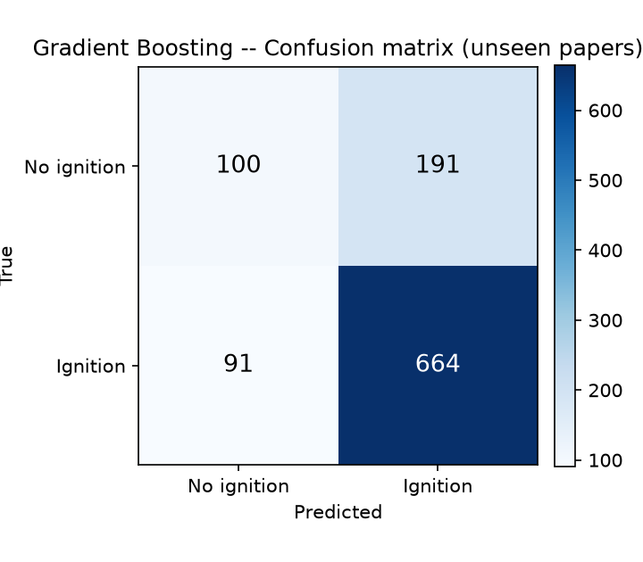
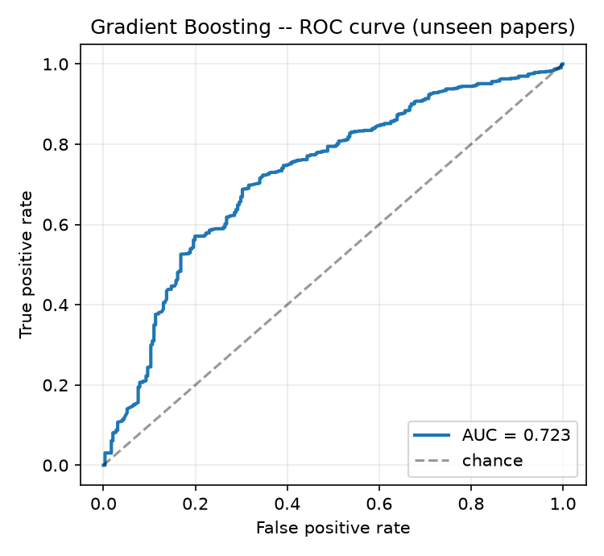
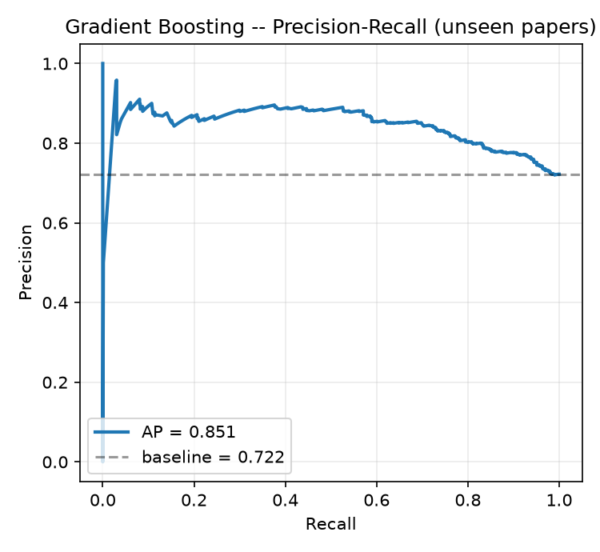
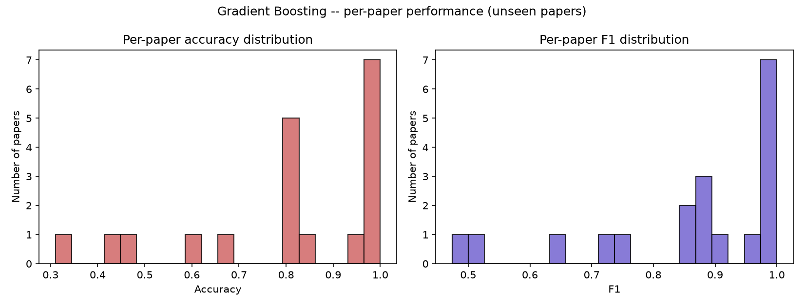
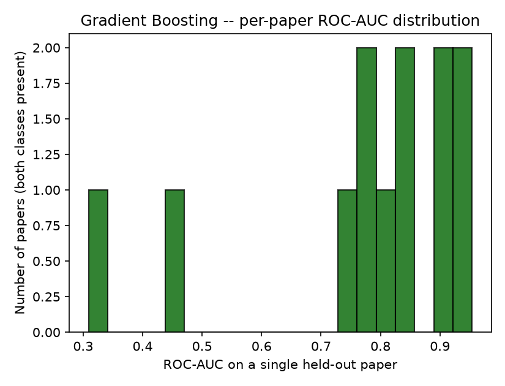
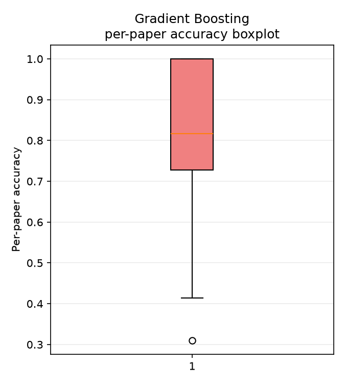
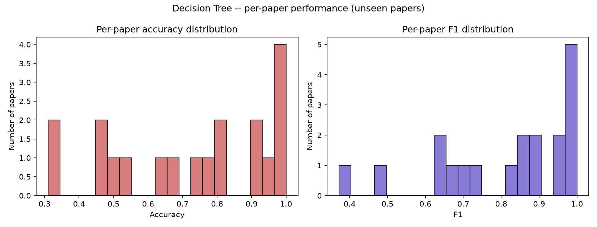
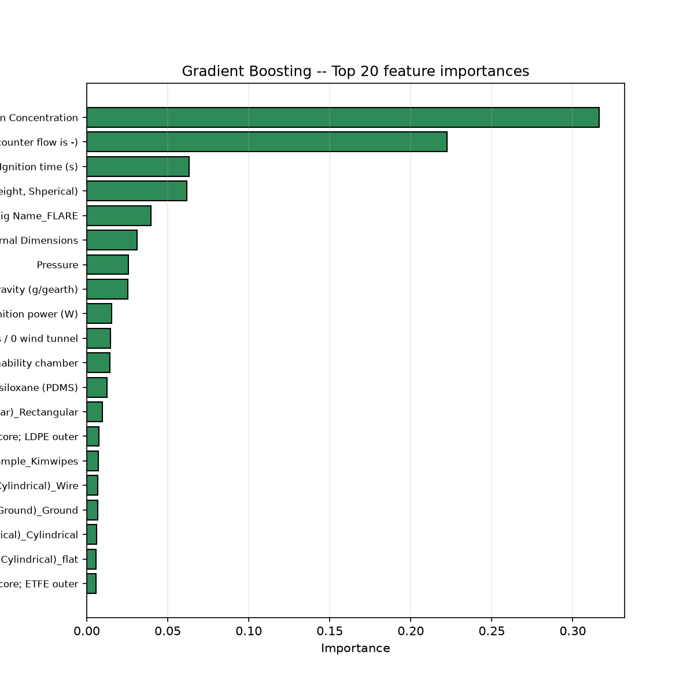
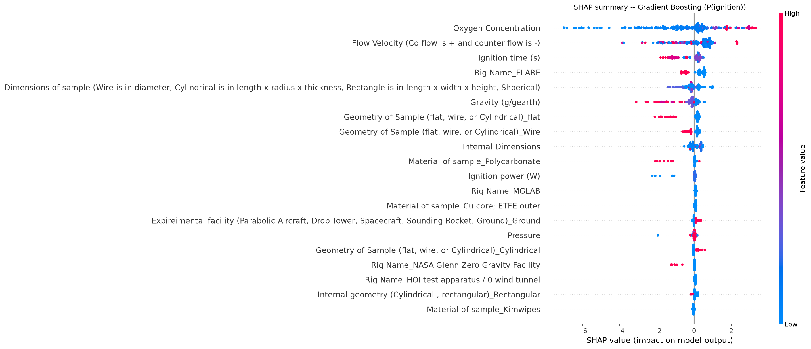
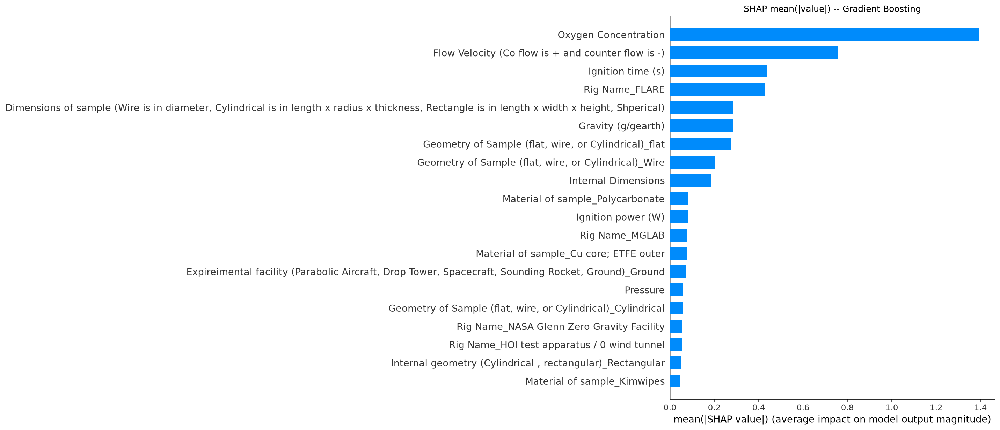

# Predicting Ignition (Yes/No) in Microgravity Combustion
### A paper-aware (extrapolation-first) machine-learning study

**Models compared:** Decision Tree · Gradient Boosting · K-Nearest Neighbors
**Target:** Ignition (Yes/No) — a **binary classification** problem
**Data:** `Microgravity_Database.xlsm` (sheet `Sheet2`)
**Code:** [`ignition_classification.py`](ignition_classification.py)
**Reproducibility:** `random_state = 42` everywhere; full console log in [`run_log.txt`](run_log.txt)

---

## 0. Regression vs classification — an important note

This folder is named **`Ignition Regression`** to mirror the companion **`FSR Regression`**
study, and it uses the **same three model families** and the **same paper-aware,
extrapolation-first methodology**. However, the ignition target is **binary** (`Yes`/`No`),
so the scientifically correct task is **classification, not regression**. Forcing a regressor
onto a 0/1 label would produce meaningless metrics (e.g. R² on a Bernoulli target). We
therefore keep the requested folder name but use the **classifier** variants
(`DecisionTreeClassifier`, `GradientBoostingClassifier`, `KNeighborsClassifier`) and report
classification metrics (ROC-AUC, PR-AUC, F1, balanced accuracy, MCC, …). This matches how the
repository's existing ignition models (`xgb_ignition_model.py`, `mlp_ignition_model.py`) treat
the problem.

---

## 1. Executive summary

We train, tune, evaluate and compare three classifiers to predict whether a microgravity
combustion sample **ignites**, using the same extrapolation-first protocol as the FSR study:
because the database aggregates many correlated rows per paper, all rows of any paper are kept
entirely in train **or** entirely in test (never split), so we measure prediction on
**completely unseen papers / campaigns / rigs**.

**Headline result (primary, group-aware / unseen papers, sorted by ROC-AUC):**

| Rank | Model | ROC-AUC | PR-AUC | Bal. Acc | F1 | MCC |
|---|---|---|---|---|---|---|
| 1 | **Gradient Boosting** | **0.723** | 0.851 | 0.612 | 0.825 | 0.259 |
| 2 | **KNN** | 0.650 | 0.805 | 0.588 | 0.787 | 0.184 |
| 3 | **Decision Tree** | 0.472 | 0.726 | 0.474 | 0.787 | −0.077 |

**Best model by the tuning criterion (GroupKFold CV ROC-AUC): Gradient Boosting** (0.685).

Two findings stand out:

1. **Extrapolation is much harder than interpolation.** Group-aware ROC-AUC (0.47–0.72) is far
   below random-split ROC-AUC (0.79–0.90); the generalization gap is **+0.18 to +0.32 AUC**.
2. **The Decision Tree fails dramatically out-of-sample** — its group ROC-AUC (0.472) is
   *below 0.5* (worse than random ranking on unseen papers) despite a respectable random-split
   AUC of 0.792. This is textbook paper-specific over-fitting and is exactly what a random
   split hides.

---

## 2. The dataset

| Property | Value |
|---|---|
| Rows loaded from `Sheet2` | 5,118 |
| Rows with a valid Yes/No label (kept) | **5,093** |
| Rows removed (missing / ambiguous label) | 25 |
| Detected target column | `Ignition (Yes/No)` |
| Detected paper-grouping column | `Article (MLA)` |
| Unique papers | **93** |
| Numeric features | 8 |
| Categorical features | 6 |

**Class balance (imbalanced):**

| Class | Count | Share |
|---|---|---|
| Ignition (1) | 3,887 | **76.3%** |
| No-ignition (0) | 1,206 | 23.7% |

The 76/24 imbalance is why **accuracy alone is misleading** here: a trivial "always predict
ignition" classifier already scores ~76% accuracy. The honest metrics are therefore
**ROC-AUC, PR-AUC, balanced accuracy and MCC**, which a majority-class guesser cannot fake.

**Samples per paper** (why paper-aware evaluation is essential):

| Statistic | Value |
|---|---|
| Mean | 54.76 |
| Median | 33.0 |
| Min | 4 |
| Max | 309 |
| Std | 55.9 |

---

## 3. End-to-end pipeline overview

```
Excel (two-row header)
   │  load_database()  ── flatten section/field header, tidy text, drop empty cols
   ▼
Automatic column-role detection
   ├─ detect_target_column()   → Ignition (Yes/No)   (requires a ~binary column)
   ├─ detect_group_column()    → Article (MLA)
   ├─ detect_leakage_columns() → drop post-ignition outcomes / notes / paper ids
   └─ detect_feature_types()   → numeric vs categorical (unit-string aware)
   ▼
Shared preprocessing  (ColumnTransformer)
   ├─ numeric:     median impute → StandardScaler
   └─ categorical: most-frequent impute → OneHotEncoder(handle_unknown="ignore")
   ▼
Two evaluation splits
   ├─ A: stratified random split   (baseline, interpolation)
   └─ B: GroupShuffleSplit         (PRIMARY, extrapolation — no shared papers)
   ▼
Per model: RandomizedSearchCV with GroupKFold (ROC-AUC)  → best hyper-parameters
   ▼
Evaluate on BOTH splits → metrics, plots, per-paper analysis,
                          feature/permutation/SHAP importance, comparison, saved models
```

---

## 4. Design choices and scientific reasoning

### 4.1 Automatic, binary-aware target detection
The database contains several "ignition"-named columns (`Ignition method`, `Ignition power (W)`,
`Ignition time (s)`) that are **inputs**, not the outcome. Target detection therefore requires
both a name match *and* that ≥ 80% of values map cleanly to a binary {0,1} encoding, which
uniquely selects `Ignition (Yes/No)`.

### 4.2 Leakage prevention — the critical difference from the FSR study
For ignition, the **post-ignition outcomes** are the leak: `FSR (Flame Spread Rate)`,
`Flame Length`, `HRR (Heat release rate)` and `Smoke/Aerosols` are all observed only *after*
(and conditional on) ignition, so using them as predictors would be cheating. The script
removes them, along with free-text notes (`Info`) and paper-identity fingerprints
(`Authors`, `DOI`, `Article (MLA)`).

| Removed column | Reason |
|---|---|
| `Ignition (Yes/No)` | the target (held out separately) |
| `Article (MLA)` | grouping key (held out separately) |
| `Authors`, `DOI` | paper-identity fingerprints — would let the model memorise papers |
| `FSR (Flame Spread Rate)` | **post-ignition outcome (leakage)** |
| `Flame Length` | post-ignition outcome (leakage) |
| `HRR (Heat release rate)` | post-ignition outcome (leakage) |
| `Smoke/ Areosols (yes/no)` | post-ignition outcome (leakage) |
| `Info` | free-text notes |

**Kept as valid predictors:** `Ignition method`, `Ignition power (W)`, `Ignition time (s)` —
these describe the *stimulus applied*, which is known before the outcome is observed.

### 4.3 Everything else mirrors the FSR study
* **Automatic numeric/categorical detection** with unit-string parsing (`"94 W"`,
  `"101.3 kPa"` → numeric).
* **One shared preprocessing pipeline**: median impute + `StandardScaler` (numeric, essential
  for KNN); most-frequent impute + `OneHotEncoder(handle_unknown="ignore")` (categorical, so
  categories that appear only in unseen test papers do not crash inference).
* **Two strategies**: (A) *stratified* random split — baseline/interpolation; (B)
  `GroupShuffleSplit` by paper — primary/extrapolation, with an assertion guaranteeing no
  shared papers. Realised split: **train = 4,047 rows (74 papers)**, **test = 1,046 rows
  (19 papers)**, test prevalence 72.2% ignition.
* **Tuning always via `GroupKFold`** with `scoring="roc_auc"` (threshold-independent and
  robust to the class imbalance); random CV variants are deliberately not used.
* The Decision Tree additionally tunes `class_weight ∈ {None, "balanced"}` to cope with the
  imbalance; GB and KNN have no native class-weight knob, so we rely on ROC-AUC tuning and
  report balanced metrics.

---

## 5. Models and tuned hyper-parameters

| Model | Search space (tuned) | Selected best hyper-parameters |
|---|---|---|
| Decision Tree | `max_depth`, `min_samples_split`, `min_samples_leaf`, `max_features`, `class_weight` | `max_depth=12, min_samples_split=40, min_samples_leaf=4, max_features='sqrt', class_weight=None` |
| Gradient Boosting | `n_estimators`, `learning_rate`, `max_depth`, `subsample`, `min_samples_leaf` | `n_estimators=300, learning_rate=0.2, max_depth=4, subsample=0.9, min_samples_leaf=2` |
| KNN | `n_neighbors`, `weights`, `p` | `n_neighbors=11, weights='uniform', p=1 (Manhattan)` |

---

## 6. Metric definitions

| Metric | Reading |
|---|---|
| **Accuracy** | fraction correct — *misleading under 76/24 imbalance* (majority guess ≈ 0.76) |
| **Balanced Accuracy** | mean of per-class recall — robust to imbalance |
| **Precision** | of predicted ignitions, how many truly ignited |
| **Recall** | of true ignitions, how many were caught |
| **F1** | harmonic mean of precision & recall |
| **ROC-AUC** | threshold-independent ranking quality (0.5 = random) — primary tuning metric |
| **PR-AUC** | average precision; the right summary under imbalance |
| **MCC** | Matthews correlation; balanced single score (0 = no skill, <0 = anti-correlated) |

---

## 7. Benchmark results

### 7.1 Full comparison (both strategies, sorted by Group ROC-AUC)

| Model | Strategy | Accuracy | Bal. Acc | Precision | Recall | F1 | ROC-AUC | PR-AUC | MCC |
|---|---|---|---|---|---|---|---|---|---|
| Gradient Boosting | **Group-Aware** | 0.730 | 0.612 | 0.777 | 0.880 | 0.825 | **0.723** | 0.851 | 0.259 |
| Gradient Boosting | Random Split | 0.826 | 0.744 | 0.876 | 0.900 | 0.888 | 0.900 | 0.963 | 0.505 |
| KNN | **Group-Aware** | 0.685 | 0.588 | 0.769 | 0.805 | 0.787 | 0.650 | 0.805 | 0.184 |
| KNN | Random Split | 0.799 | 0.686 | 0.846 | 0.900 | 0.872 | 0.859 | 0.944 | 0.405 |
| Decision Tree | **Group-Aware** | 0.655 | 0.474 | 0.710 | 0.882 | 0.787 | 0.472 | 0.726 | −0.077 |
| Decision Tree | Random Split | 0.777 | 0.608 | 0.808 | 0.929 | 0.864 | 0.792 | 0.920 | 0.280 |

*(machine-readable: [`results/model_comparison.csv`](results/model_comparison.csv))*

### 7.2 Generalization gap (the key scientific message)

Gap is defined on ROC-AUC as **Random − Group** (higher AUC is better, so a large positive gap
means paper-specific over-fitting):

| Model | Random ROC-AUC | Group ROC-AUC | Generalization Gap |
|---|---|---|---|
| Gradient Boosting | 0.900 | 0.723 | **+0.177** |
| KNN | 0.859 | 0.650 | **+0.208** |
| Decision Tree | 0.792 | 0.472 | **+0.321** |

*(machine-readable: [`results/generalization_gap.csv`](results/generalization_gap.csv))*

Every model looks far better under random splitting. The **Decision Tree** has the largest gap
and collapses to **below-chance ranking (AUC 0.472, MCC −0.077)** on unseen papers — it has
essentially memorised paper-specific patterns that do not transfer. **Gradient Boosting is the
most robust**, retaining genuine discriminative skill (AUC 0.723, PR-AUC 0.851) out-of-sample.

> **Reading the accuracy numbers carefully:** GB's group accuracy (0.730) is barely above the
> 0.722 majority-class baseline, but its **ROC-AUC 0.723 / PR-AUC 0.851 / MCC 0.259** show it
> ranks ignition vs no-ignition meaningfully better than chance. This is precisely why we tune
> and select on AUC rather than accuracy.

---

## 8. Model selection

Selection is by the tuning criterion — **GroupKFold cross-validated ROC-AUC** on the training
papers — not the random split:

| Model | GroupKFold CV ROC-AUC | |
|---|---|---|
| **Gradient Boosting** | **0.685** | ← selected best |
| Decision Tree | 0.665 | |
| KNN | 0.583 | |

The CV ranking agrees with the held-out ranking that **Gradient Boosting is best**, so it is
carried forward for permutation-importance and SHAP analysis.

---

## 9. Per-model diagnostic figures (primary group/unseen-paper split)

### 9.1 Gradient Boosting (selected best)
| Confusion matrix | ROC curve | Precision-Recall |
|---|---|---|
|  |  |  |

### 9.2 KNN
| Confusion matrix | ROC curve | Precision-Recall |
|---|---|---|
|  |  |  |

### 9.3 Decision Tree
| Confusion matrix | ROC curve | Precision-Recall |
|---|---|---|
|  |  |  |

All three models are biased toward predicting the majority "Ignition" class (high recall, lower
specificity) — visible as the populated top row of each confusion matrix and the modest
balanced accuracy.

---

## 10. Per-paper generalization analysis

Average metrics hide per-paper failures, so each held-out paper is scored separately.

### 10.1 Gradient Boosting (best model)
| Per-paper accuracy & F1 | Per-paper ROC-AUC | Per-paper accuracy boxplot |
|---|---|---|
|  |  |  |

Performance is highly heterogeneous across the 19 unseen test papers: some are classified almost
perfectly while others (e.g. *Urban et al. 2025, "Solid Fuel Ignition Testing for Lunar
Applications"*, per-paper AUC ≈ 0.31) are predicted worse than chance. Several papers contain
only one class (all samples ignited or none did), so their per-paper ROC-AUC is undefined and is
correctly omitted from the AUC histogram. This dispersion is invisible in the single aggregate
number and is exactly what a reviewer needs before trusting the model on a new campaign.

*(per-paper tables: [`results/per_paper_metrics_gradient_boosting.csv`](results/per_paper_metrics_gradient_boosting.csv),
`per_paper_metrics_knn.csv`, `per_paper_metrics_decision_tree.csv`)*

### 10.2 KNN and Decision Tree
| KNN per-paper accuracy/F1 | Decision Tree per-paper accuracy/F1 |
|---|---|
|  |  |

---

## 11. Feature importance (Decision Tree & Gradient Boosting)

Top-20 impurity-based importances, names recovered after one-hot encoding.

| Decision Tree | Gradient Boosting |
|---|---|
|  |  |

*(CSVs: [`results/feature_importance_decision_tree.csv`](results/feature_importance_decision_tree.csv),
[`results/feature_importance_gradient_boosting.csv`](results/feature_importance_gradient_boosting.csv))*

Both models rank **Oxygen Concentration** and **Flow Velocity** at the top, with
**Ignition time**, sample **Dimensions**, **Pressure** and **Gravity** also prominent —
physically sensible, since ignition depends on oxidiser supply, convective cooling/transport
and the energy/duration of the ignition stimulus.

---

## 12. Permutation importance (best model: Gradient Boosting)

Computed on the **held-out unseen papers** with ROC-AUC scoring, so it reflects what actually
drives *extrapolation* performance (AUC lost when a feature is shuffled).


*(ranked table: [`results/permutation_importance.csv`](results/permutation_importance.csv))*

**Oxygen Concentration dominates** (≈0.156 AUC drop when shuffled), an order of magnitude above
the next features (Material, Ignition time, sample Dimensions, Pressure, Gravity, Flow
velocity). A few features have slightly negative permutation importance, indicating reliance
that does not transfer to these particular unseen papers.

---

## 13. SHAP analysis (best model: Gradient Boosting)

SHAP values quantify each feature's signed contribution to the predicted **P(ignition)**
(exact `TreeExplainer` on the post-preprocessing feature space).

| SHAP summary (beeswarm) | SHAP mean(\|value\|) bar |
|---|---|
|  |  |

*(ranked table: [`results/shap_ranking_gradient_boosting.csv`](results/shap_ranking_gradient_boosting.csv))*

**Top SHAP drivers of ignition:**

1. **Oxygen Concentration** — by far the strongest driver (mean|SHAP| ≈ 1.39). Higher O₂ →
   higher ignition probability, the central result of microgravity flammability research.
2. **Flow Velocity** — convective oxidiser transport vs. flame cooling.
3. **Ignition time** — longer stimulus exposure → more likely ignition.
4. **Rig / facility terms** (e.g. `Rig Name=FLARE`) — systematic apparatus effects.
5. **Sample dimensions, gravity, geometry (flat/wire), material** — fuel thermal inertia and
   environment.

**Physical interpretation:** the data-driven ranking matches combustion theory — ignition in
microgravity is governed first by **oxidiser availability and transport** (O₂, flow, pressure),
then by the **ignition stimulus** (time/power) and the **fuel's thermal/geometric properties**,
with **gravity** modulating buoyant transport. The appearance of rig/facility terms again flags
apparatus-specific signal, reinforcing why whole papers must be held out.

---

## 14. Conclusions

1. **Ignition is predictable but extrapolation is hard.** The best model (Gradient Boosting)
   reaches group-aware ROC-AUC 0.723 / PR-AUC 0.851 on unseen papers — useful, but well below
   its random-split AUC of 0.900.
2. **Gradient Boosting is the selected and most robust model**; KNN is moderate; the **Decision
   Tree over-fits catastrophically** (group AUC 0.472 < 0.5, MCC < 0).
3. **Generalization gaps of +0.18 to +0.32 AUC** prove that random-split metrics substantially
   overstate real-world ignition-prediction capability.
4. **Oxygen concentration is the dominant, physically-consistent driver** across feature
   importance, permutation importance and SHAP, followed by flow velocity and the ignition
   stimulus.
5. **Accuracy is the wrong headline metric** under this 76/24 imbalance; ROC-AUC, PR-AUC,
   balanced accuracy and MCC tell the honest story and are used for tuning/selection.

### Limitations & future work
* First-number parsing of unit-laden columns is transparent but not unit-normalised.
* Class imbalance could be tackled more aggressively (SMOTE, focal/weighted losses, calibrated
  thresholds tuned per operating point).
* Probability **calibration** (Platt/Isotonic) and decision-threshold selection would make the
  predicted probabilities directly actionable for flammability screening.
* Only 93 papers / 19 test papers → noisy holdout; leave-one-paper-out CV and more sources
  would tighten estimates.

---

## 15. Reproducibility & how to run

```bash
pip install pandas scikit-learn numpy matplotlib joblib openpyxl shap
python "Ignition Regression/ignition_classification.py"            # full run (writes results/)
python "Ignition Regression/ignition_classification.py" --no-shap  # skip the slower SHAP step
python "Ignition Regression/ignition_classification.py" --n-iter 60 # wider hyper-parameter search
```

* `random_state = 42` for every split, search and model.
* The script auto-locates `Microgravity_Database.xlsm` and writes all artefacts to
  `Ignition Regression/results/` by default.

### Files in this folder
| File | Contents |
|---|---|
| `ignition_classification.py` | the complete, commented, runnable script |
| `REPORT.md` | this report |
| `run_log.txt` | full console output of the benchmarked run |
| `results/model_comparison.csv` | metrics for all models × both strategies |
| `results/generalization_gap.csv` | random vs group ROC-AUC + gap |
| `results/metrics.json` | machine-readable summary (sizes, balance, features, params, scores) |
| `results/confusion_matrix_*.png`, `roc_curve_*.png`, `pr_curve_*.png` | per-model diagnostics |
| `results/per_paper_*` | per-paper extrapolation analysis (CSV + plots) |
| `results/feature_importance_*` | Decision Tree & Gradient Boosting importances |
| `results/permutation_importance.*` | best-model permutation importance |
| `results/shap_summary_*`, `shap_bar_*`, `shap_ranking_*` | best-model SHAP analysis |
| `results/best_decision_tree.joblib`, `best_gradient_boosting.joblib`, `best_knn.joblib` | saved fitted pipelines |
