# Machine-Learned Ignition Classification for Solid Fuels Across Gravity Regimes: A Leakage-Controlled Benchmark of Five Model Families

**Dataset:** `Microgravity_Database_reduced.csv` (fingerprint `9a4053a7…1afdf26`, version `fable-data-v3`)
**Code:** this directory (`fable_splits.py` → `fable_evaluate.py` → `fable_select.py` → `fable_refit.py` → `fable_report.py`)
**Base random seed:** 42 · **Evaluated splits:** 118 · **Candidate models:** 15 · **Bootstrap iterations:** 2,000

---

## Abstract

We present a systematic machine-learning benchmark for predicting whether a solid fuel sample **ignites** under a given set of environmental and material conditions, using a curated database of 4,499 experimental records extracted from 85 published microgravity and normal-gravity combustion studies. Fifteen candidate classifiers spanning five model families (gradient-boosted trees, k-nearest neighbors, decision trees, multi-layer perceptrons, and support-vector machines) were compared under a rigorously leakage-controlled protocol that separates two distinct scientific questions: **interpolation** (predicting new conditions similar to those already studied) and **extrapolation** (predicting outcomes for entirely unseen experimental campaigns). All hyperparameter tuning, feature preprocessing, and decision-threshold selection were nested strictly inside training folds, and uncertainty was quantified with fold statistics and 2,000-iteration bootstrap confidence intervals that respect the clustered structure of the data.

An XGBoost classifier using all 44 features achieved the best interpolation performance (ROC-AUC 0.914 ± 0.006; PR-AUC 0.972 ± 0.003). Under paper-level extrapolation, performance dropped substantially for every model — quantifying the cost of campaign-to-campaign heterogeneity — and an XGBoost classifier restricted to 24 physics-only features became the best model (ROC-AUC 0.721 ± 0.066; PR-AUC 0.879 ± 0.045), with apparatus-descriptor features *hurting* transfer to unseen campaigns. Leave-one-paper-out analysis showed a median within-paper ROC-AUC of 0.80, with 12 of 45 evaluable papers above 0.90 and only 3 below chance. SHAP and permutation-importance analyses identified oxygen fraction, fuel pyrolysis temperature, ambient-gas molar mass, flow speed, and gravity level as the dominant predictors, in agreement with established flammability physics. We release all splits, predictions, metrics, and deployable models with full data fingerprints for reproducibility.

---

## Table of contents

1. [Introduction](#1-introduction)
2. [Data](#2-data)
3. [Methods](#3-methods)
4. [Results](#4-results)
5. [Discussion](#5-discussion)
6. [Limitations](#6-limitations)
7. [Reproducibility](#7-reproducibility)
8. [Using the trained models](#8-using-the-trained-models)
9. [Appendix A — Glossary](#appendix-a--glossary-of-terms)
10. [Appendix B — Hyperparameter search spaces](#appendix-b--hyperparameter-search-spaces)
11. [Appendix C — Output artifact map](#appendix-c--output-artifact-map)

---

## 1. Introduction

Fire safety is a first-order design constraint for crewed spacecraft. Whether a solid material ignites depends on a coupled set of environmental variables (oxygen fraction, pressure, forced-flow velocity, gravity level) and material properties (density, thermal conductivity, heat capacity, pyrolysis temperature). Decades of ground-based and microgravity experiments have produced a large but heterogeneous body of ignition observations scattered across the literature — each study with its own apparatus, sample geometry, ignition method, and reporting conventions.

This work asks a deliberately practical question: **given a database aggregated from 85 published studies, how well can standard machine-learning classifiers predict binary ignition outcome (`Ignition Yes/No`), and — critically — how well do those predictions transfer to experimental campaigns the model has never seen?**

Answering this requires care that generic ML benchmarking often omits:

- **The data are clustered, not independent.** Records from the same paper share fuel batches, hardware, procedures, and labeling conventions. A model can score deceptively well simply by memorizing paper-level idiosyncrasies. We therefore evaluate two separate questions — *interpolation* (row-level generalization) and *extrapolation* (paper-level generalization) — and never let one stand in for the other.
- **Information leakage is easy and fatal.** Post-outcome measurements (flame spread rate, flame length, heat release, smoke production) trivially reveal the ignition label and were excluded from all feature sets. All preprocessing, hyperparameter tuning, and decision-threshold selection were nested inside training folds so that no test information ever influenced any modeling choice.
- **A single point estimate is not evidence.** Every headline number carries fold-level dispersion and a 95% bootstrap confidence interval whose resampling unit matches the evaluation unit (individual rows for interpolation; whole paper clusters for extrapolation).

### Contributions

1. A leakage-controlled, fully reproducible benchmark of 15 model candidates × 4 evaluation protocols (118 splits) on a curated 4,499-record ignition database.
2. Quantification of the **interpolation-to-extrapolation generalization gap** (0.12–0.26 ROC-AUC depending on model), and the finding that **physics-only features transfer better** to unseen campaigns than the full feature set.
3. Champion models for each question, with operating-point analysis, calibration assessment, and physically interpretable explanations (SHAP, permutation importance).
4. Openly documented negative results (focal loss, class/paper weighting) that inform future modeling of this database.

---

## 2. Data

### 2.1 Source database and curation

The source is a literature-compiled microgravity combustion database (`Microgravity_Database_reduced.csv`). The raw file contains 5,083 data rows beneath a category header row. The loader (`fable_common.py`) applies a deterministic curation cascade:

| Step | Rule | Rows affected |
|---|---|---:|
| 1 | Parse with encoding fallback (UTF-8 → UTF-8-BOM → CP1252 → Latin-1) | — |
| 2 | Drop fully blank records | 26 removed |
| 3 | Drop exact duplicates (identical feature + label content) | 558 removed |
| 4 | Require a valid `Ignition (Yes/No)` label for training/evaluation | 0 removed (no missing labels after steps 2–3) |
| | **Final analysis dataset** | **4,499 records** |

Every downstream artifact records the dataset SHA-256 (`9a4053a73d1e0626f3efd2f1ba4abb270560457087affa87d9a8749611afdf26`) so that all results are traceable to one exact file version.

**Canonical paper identity.** Because leakage control depends on knowing which rows come from the same study, each record was assigned a canonical paper ID derived from its normalized DOI, falling back to normalized citation text when no DOI exists. Raw DOI strings are never used directly (formatting variants of the same DOI would silently split one paper into several "groups" and re-introduce leakage). This yields **85 canonical papers**.

### 2.2 Outcome variable and class structure

The prediction target is binary ignition: 3,394 ignition records (75.4%) versus 1,105 no-ignition records (24.6%). Two structural properties of the database shape everything downstream:

1. **Class imbalance.** Positives outnumber negatives roughly 3:1, so headline metrics must be imbalance-aware (PR-AUC, MCC, balanced accuracy) rather than plain accuracy — a majority-class guesser is already 75.4% "accurate".
2. **Paper heterogeneity.** Papers contribute between 3 and 398 records (median 30), and 40 of 85 papers report only a single outcome class (all-ignition or all-no-ignition). Prevalence therefore varies enormously across papers, which is exactly why paper-grouped evaluation is indispensable.

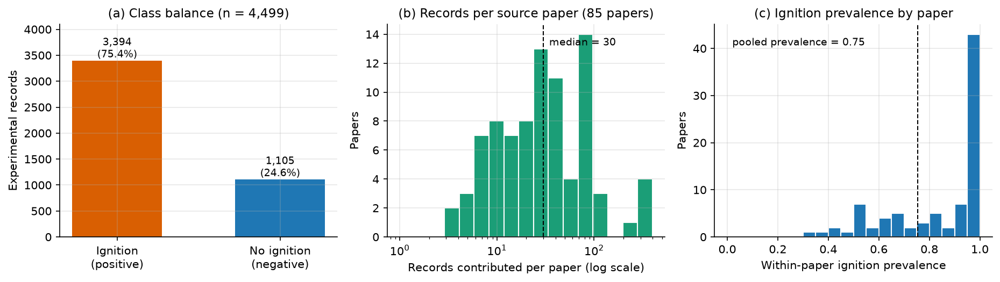

*Figure 1 — Dataset composition. (a) Class balance of the 4,499 curated records. (b) Distribution of records contributed per source paper (median 30, maximum 398). (c) Within-paper ignition prevalence; the spike at 1.0 reflects the 40 papers that report only one outcome class. The dashed line marks pooled prevalence (0.754).*

### 2.3 Features and the two feature sets

Forty-four candidate features were engineered from the source columns, with units standardized during loading. Each feature is tagged with a *role*:

- **Physics features (24):** transferable thermophysical, flow, gravity, geometry, and gas-composition variables — fuel density/conductivity/heat capacity/pyrolysis temperature/thermal diffusivity; core (substrate) density/conductivity/heat capacity; oxygen fraction; ambient-gas molar mass, heat capacity, conductivity, density, thermal and momentum diffusivities; pressure; signed and absolute flow velocity; gravity level and its log; and categorical geometry, diluent, flow direction, and gravity regime.
- **Apparatus features (20):** campaign descriptors — igniter power/time/energy, sample dimensions (7 variables), core/outer diameters, insulation thickness, internal duct dimensions (4 variables), and categorical internal geometry, facility, and ignition method.

Two feature sets are compared throughout: **`all`** (physics + apparatus, 44 features) and **`physics`** (24 features). The design rationale: apparatus descriptors may help a model fit conditions *within* known campaigns but encode information that cannot transfer to a new laboratory. Testing both sets under both evaluation questions turns this intuition into a measurable result (Section 4.4).

**Post-outcome exclusion.** Flame length, flame spread rate, heat release rate, and smoke/aerosol fields are recorded *after* the ignition outcome is known. Including them would constitute target leakage; they are excluded from every feature set.

**Missingness.** The database is observational, and many fields are sparsely reported (Figure 2). Notably, the sparsest fields are predominantly apparatus descriptors (insulation thickness 99% missing, outer diameter 98%, igniter power/energy 80%), whereas core physics drivers (oxygen fraction, gas properties, fuel properties) are nearly complete. Missing numeric values are median-imputed inside each training fold for scikit-learn models; XGBoost uses its native missing-value routing. Categoricals use constant imputation with unknown-safe one-hot encoding (categories never seen in training are encoded as all-zeros rather than crashing or leaking).

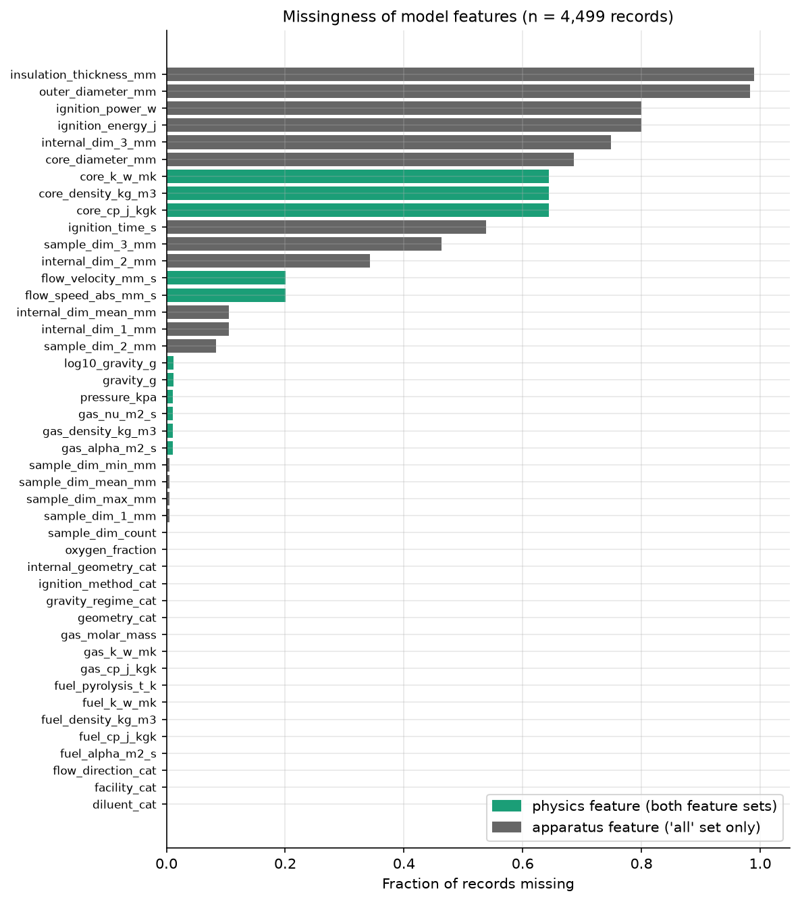

*Figure 2 — Fraction of records missing each model feature, colored by feature role. Apparatus descriptors (gray) dominate the high-missingness regime; physics features (green) are mostly complete, except substrate ("core") properties which only apply to cylindrical/wire configurations and flow velocity which is undefined for ~20% of records.*

---

## 3. Methods

### 3.1 Two scientific questions, two evaluation designs

The central design decision of this study is that **"how accurate is the model?" is ill-posed for clustered data** — the answer depends on what the model will be asked to do:

- **Interpolation** — *"Predict ignition for a new test condition drawn from the same kinds of campaigns already in the database."* Here it is legitimate for training and test sets to share papers, because deployment will also occur within known campaigns. We measure this with row-level splits.
- **Extrapolation** — *"Predict ignition for a brand-new campaign (new lab, new hardware, new fuel lot) never seen in training."* Here sharing a paper between training and test would be cheating. We measure this with paper-grouped splits in which **no canonical paper ever appears in both partitions**.

Neither number substitutes for the other. Reporting only interpolation would overstate readiness for new campaigns; reporting only extrapolation would understate value for in-distribution screening.

### 3.2 Evaluation protocols

`fable_splits.py` materializes every partition once, up front, and writes exact row/paper memberships with integrity checks (118 splits verified). All models see identical splits, making comparisons paired.

| Protocol | Question | Mechanics | Splits |
|---|---|---|---:|
| `interpolation_holdout` | Interpolation | Repeated stratified 80/20 train/test holdout, 3 seeds | 3 |
| `interpolation_stratified` | Interpolation (primary) | Stratified 5-fold cross-validation, 3 seeds | 15 |
| `extrapolation_grouped` | Extrapolation (primary) | `StratifiedGroupKFold(5)` over canonical papers, 3 seeds | 15 |
| `lopo` | Extrapolation robustness | Leave-One-Paper-Out: each of the 85 papers held out in turn | 85 |

Repetition over 3 seeds (42, 43, 44) separates genuine model differences from split luck. LOPO is mandated as a *robustness analysis* — it reveals paper-by-paper variability that the grouped 5-fold averages away — but is deliberately not the sole selection basis, because single-paper test sets are small and 40 of 85 papers contain only one class (making ROC-AUC undefined for them).

### 3.3 Leakage controls

Every result in this paper is protected by the following controls, implemented in `fable_evaluate.py`:

1. **Nested hyperparameter search.** For each outer fold, a 40-iteration random search runs *only on that fold's training data*, scored by inner cross-validation ROC-AUC: stratified 3-fold inner splits for interpolation, paper-grouped 3-fold inner splits for extrapolation/LOPO. Outer test rows are invisible to the search.
2. **Preprocessing inside the fold.** Imputation medians, scaling statistics, one-hot vocabularies, and sample weights are fitted per training fold — never on pooled data.
3. **Frozen decision thresholds.** All four operating thresholds (Section 3.5) are selected on inner out-of-fold validation predictions and *frozen before* the outer test fold is scored.
4. **LOPO hyperparameter policy.** Re-tuning 40 configurations for each of 85 LOPO folds would be computationally redundant, so for each held-out paper the hyperparameters are frozen to the *modal* configuration selected by the repeated grouped outer folds whose training partitions already excluded that paper (modal ties resolved lexically). This avoids LOPO-paper leakage without extra tuning bias. LOPO thresholds are still fitted from grouped inner out-of-fold predictions of that fold's own training papers.
5. **Canonical paper grouping** (Section 2.1) and **post-outcome feature exclusion** (Section 2.3).
6. **Automated integrity checks.** The evaluation writes `integrity_checks.json`; the completed run passed with zero failures across all candidate/protocol combinations.

### 3.4 Candidate models

Fifteen candidates cross five model families with the two feature sets and several imbalance-handling variants (`configs/candidates.yaml`):

| Candidate | Family | Features | Class/paper weighting | Notes |
|---|---|---|---|---|
| `xgb_all_unweighted` | XGBoost | all | none | logistic objective |
| `xgb_physics_unweighted` | XGBoost | physics | none | logistic objective |
| `xgb_all_class_paper_weighted` | XGBoost | all | class + √paper | |
| `xgb_physics_class_paper_weighted_monotone_o2` | XGBoost | physics | class + √paper | monotone-increasing constraint on oxygen |
| `xgb_all_focal_class_paper_weighted` | XGBoost | all | class + √paper | focal loss (γ = 2) |
| `xgb_physics_focal_class_paper_weighted` | XGBoost | physics | class + √paper | focal loss (γ = 2) |
| `xgb_physics_paper_bagging` | XGBoost | physics | class + √paper | ensemble of 10 paper-cluster bootstrap models, monotone O₂ |
| `knn_all` / `knn_physics` | KNN | all / physics | class + √paper | distance-based baseline |
| `decision_tree_all` / `decision_tree_physics` | Decision tree | all / physics | class + √paper | interpretable baseline |
| `mlp_all` / `mlp_physics` | MLP | all / physics | class + √paper | neural-network baseline |
| `svm_all` / `svm_physics` | SVM (RBF) | all / physics | class + √paper | sigmoid-calibrated probabilities |

Design choices behind this roster:

- **Why these families?** They span the main inductive biases available for tabular data: axis-aligned trees and boosted ensembles (dominant on tabular benchmarks), local distance-based prediction (KNN), smooth kernel decision surfaces (SVM), and learned nonlinear feature interactions (MLP). A deep single tree serves as the interpretable floor.
- **Class weighting** counteracts the 3:1 imbalance; **√paper weighting** down-weights massively over-represented papers (a 398-row paper would otherwise dominate the loss ~13× more than a median 30-row paper; the square root is a compromise between per-row and per-paper equality).
- **Honest weighting for every family.** XGBoost, decision trees, and calibrated SVMs consume sample weights at fit time. KNN and MLP cannot; for those, each training fold is deterministically resampled with probability proportional to weight, so no candidate silently ignores its declared weighting policy.
- **Monotone oxygen constraint.** Flammability physics requires ignition probability to be non-decreasing in oxygen fraction (all else fixed). One physics-only variant enforces this to test whether domain constraints improve transfer.
- **Focal loss** (γ = 2) is a popular remedy for imbalance that concentrates the loss on hard examples; it is included as a hypothesis, and (Section 4.10) resoundingly fails here.
- **Paper bagging** trains 10 XGBoost models on paper-cluster bootstrap resamples and averages probabilities, testing whether campaign-level ensembling stabilizes extrapolation.

Preprocessing is family-appropriate: standard scaling for KNN/MLP/SVM (distance- and gradient-based methods need comparable feature scales); no scaling for tree-based methods (invariant to monotone transforms); median imputation for scikit-learn estimators; native missing-value branch routing for XGBoost.

### 3.5 Decision thresholds

A probabilistic classifier requires a threshold to make yes/no calls, and the "right" threshold depends on the cost structure of the application (e.g., NASA screening should rarely miss a flammable material; a research tool may prefer balanced errors). Rather than crown one threshold, we freeze four — each optimized on inner validation predictions only:

| Policy | Optimizes | Character |
|---|---|---|
| `mcc` | Matthews correlation coefficient | best all-around single-number balance |
| `f1` | F1 score | recall-leaning under imbalance; permissive threshold |
| `balanced_accuracy` | mean of sensitivity and specificity | equal per-class error weighting |
| `youden_j` | sensitivity + specificity − 1 | epidemiological convention; here coincides with balanced accuracy |

No threshold is declared universally best; Section 4.7 reports the full operating-point table so downstream users can pick according to their own error costs.

### 3.6 Metrics

- **ROC-AUC** (primary; also the tuning objective): threshold-independent ranking quality; 0.5 = chance.
- **PR-AUC**: precision-recall area, more informative under imbalance; the no-skill baseline equals prevalence (0.754), not 0.5.
- **Brier score**: mean squared error of the predicted probabilities; measures calibration + sharpness (lower is better).
- **MCC, F1, balanced accuracy, sensitivity, specificity, precision** at each frozen threshold: the operational view.

### 3.7 Uncertainty quantification

Two complementary mechanisms:

1. **Fold dispersion.** Every protocol mean is reported ± the standard deviation across its outer folds (15 folds for the primary protocols).
2. **Bootstrap confidence intervals.** 2,000-iteration bootstrap of the pooled outer-fold predictions, with the resampling unit matched to the inference unit: unique rows for interpolation, but **whole canonical-paper clusters** for grouped protocols. Resampling rows within clustered data would pretend the 4,499 records are independent and produce intervals that are far too narrow; the cluster bootstrap is the statistically honest choice and is visibly wider (Figure 5). Repeated predictions for the same row (across seeds) are averaged before resampling.

### 3.8 Champion selection policy

Model selection is itself a researcher degree of freedom, so it was fixed in a declarative policy file (`configs/selection_policy.yaml`) and executed by code that trains nothing (`fable_select.py`):

- **Eligibility:** integrity checks passed; complete folds; valid probabilities; fold ROC-AUC standard deviation ≤ 0.15 (stability filter).
- **Primary criterion:** highest mean ROC-AUC on the question's primary protocol (`interpolation_stratified` or `extrapolation_grouped`).
- **Tie handling:** candidates within 0.01 ROC-AUC of the leader are considered tied; ties break by higher PR-AUC → lower uncertainty → (extrapolation only) physics-only features → simpler model family → fewer features.
- **Refit rule:** the deployable model is rebuilt on all 4,499 labeled rows using the modal outer-fold-selected hyperparameter configuration (lexical tie resolution), with final thresholds derived from full-data out-of-fold predictions under the matching protocol.

The physics-only tie-breaker for extrapolation encodes a scientific prior: when two models are statistically indistinguishable on unseen-paper performance, prefer the one whose inputs are physically transferable.

### 3.9 Pipeline overview

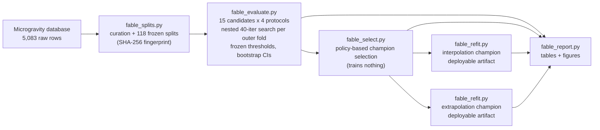

---

## 4. Results

### 4.1 Headline results

| Question | Champion | Features | ROC-AUC (fold mean ± SD) | ROC-AUC 95% bootstrap CI | PR-AUC | Brier |
|---|---|---|---|---|---|---|
| Interpolation | `xgb_all_unweighted` | all (44) | **0.914 ± 0.006** | 0.918 [0.909, 0.925] | 0.972 ± 0.003 | 0.105 |
| Extrapolation | `xgb_physics_unweighted` | physics (24) | **0.721 ± 0.066** | 0.724 [0.662, 0.792] | 0.879 ± 0.045 | 0.173 |

Both champions are unweighted XGBoost models with logistic objectives — but they differ in feature set, and each answers a different question. The interpolation champion should be used for screening conditions within campaigns like those in the database; the extrapolation champion is the appropriate (and more conservative) tool for new campaigns.

### 4.2 Interpolation: full leaderboard

Primary protocol: stratified 5-fold CV × 3 seeds (15 folds; 13,497 pooled test predictions — each record scored once per seed).

| Rank | Candidate | ROC-AUC | PR-AUC | fold SD | Features |
|---:|---|---:|---:|---:|---|
| 1 | `xgb_all_unweighted` | **0.9141** | 0.9720 | 0.0064 | all |
| 2 | `xgb_all_class_paper_weighted` | 0.9134 | 0.9715 | 0.0067 | all |
| 3 | `xgb_physics_unweighted` | 0.8978 | 0.9658 | 0.0077 | physics |
| 4 | `xgb_physics_class_paper_weighted_monotone_o2` | 0.8949 | 0.9648 | 0.0093 | physics |
| 5 | `xgb_physics_paper_bagging` | 0.8747 | 0.9578 | 0.0137 | physics |
| 6 | `mlp_all` | 0.8651 | 0.9537 | 0.0122 | all |
| 7 | `svm_all` | 0.8645 | 0.9523 | 0.0115 | all |
| 8 | `decision_tree_all` | 0.8539 | 0.9381 | 0.0196 | all |
| 9 | `svm_physics` | 0.8445 | 0.9438 | 0.0132 | physics |
| 10 | `mlp_physics` | 0.8421 | 0.9442 | 0.0143 | physics |
| 11 | `decision_tree_physics` | 0.8375 | 0.9351 | 0.0156 | physics |
| 12 | `knn_physics` | 0.8260 | 0.9279 | 0.0134 | physics |
| 13 | `knn_all` | 0.8229 | 0.9295 | 0.0134 | all |
| 14 | `xgb_all_focal_class_paper_weighted` | 0.4915 | 0.7526 | 0.0111 | all |
| 15 | `xgb_physics_focal_class_paper_weighted` | 0.4892 | 0.7528 | 0.0260 | physics |

The independent repeated 80/20 holdout protocol reproduces this ordering almost exactly (top model `xgb_all_unweighted` at 0.9130 ± 0.0114; see `results/report/interpolation_holdout_leaderboard.md`), confirming the ranking is not an artifact of the CV scheme. Three observations:

- **XGBoost dominates interpolation.** All five non-focal XGBoost variants outrank every other family. This matches the broader literature on tabular data with mixed types, missingness, and nonlinear thresholds.
- **The `all` feature set helps within known campaigns** (+0.016 ROC-AUC over physics-only for the same model), showing that apparatus descriptors carry real in-distribution signal.
- **Weighting was unnecessary here.** The class/paper-weighted variant is statistically indistinguishable from the unweighted one (Δ = 0.0007); the tie-breaking cascade selected the unweighted model.

### 4.3 Extrapolation: full leaderboard

Primary protocol: `StratifiedGroupKFold(5)` over canonical papers × 3 seeds (15 folds; no paper ever spans train and test).

| Rank | Candidate | ROC-AUC | PR-AUC | fold SD | Features |
|---:|---|---:|---:|---:|---|
| 1 | `xgb_physics_unweighted` | **0.7210** | 0.8787 | 0.0656 | physics |
| 2 | `xgb_physics_class_paper_weighted_monotone_o2` | 0.7151 | 0.8772 | 0.0763 | physics |
| 3 | `xgb_physics_paper_bagging` | 0.7133 | 0.8778 | 0.0630 | physics |
| 4 | `knn_physics` | 0.7040 | 0.8706 | 0.0673 | physics |
| 5 | `xgb_all_unweighted` | 0.7018 | 0.8713 | 0.0477 | all |
| 6 | `svm_physics` | 0.6995 | 0.8790 | 0.0631 | physics |
| 7 | `xgb_all_class_paper_weighted` | 0.6983 | 0.8672 | 0.0482 | all |
| 8 | `mlp_physics` | 0.6958 | 0.8661 | 0.0833 | physics |
| 9 | `mlp_all` | 0.6579 | 0.8538 | 0.0846 | all |
| 10 | `decision_tree_physics` | 0.6560 | 0.8277 | 0.0571 | physics |
| 11 | `svm_all` | 0.6429 | 0.8590 | 0.0784 | all |
| 12 | `knn_all` | 0.6284 | 0.8295 | 0.0562 | all |
| 13 | `decision_tree_all` | 0.5956 | 0.8011 | 0.1106 | all |
| 14 | `xgb_all_focal_class_paper_weighted` | 0.4923 | 0.7524 | 0.0261 | all |
| 15 | `xgb_physics_focal_class_paper_weighted` | 0.4911 | 0.7542 | 0.0232 | physics |

The pattern flips relative to interpolation: **the top four models are all physics-only**, and within every family the physics variant beats or matches its `all` counterpart. Fold standard deviations are roughly ten times larger than under interpolation — different held-out paper groups are genuinely different problems.

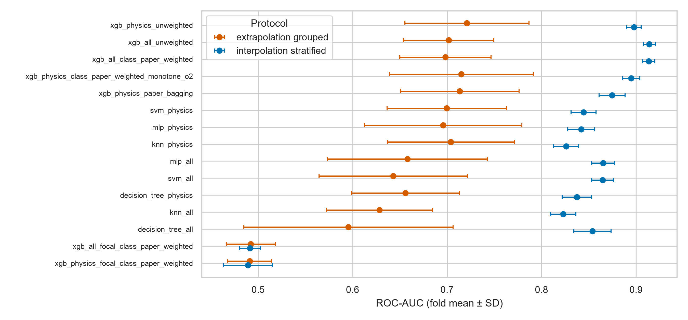

*Figure 3 — Fold-mean ROC-AUC ± SD for all 15 candidates under the two primary protocols. The interpolation estimates (blue) are tight; the extrapolation estimates (orange) are lower and much more dispersed. The two focal-loss variants sit at chance under both protocols.*

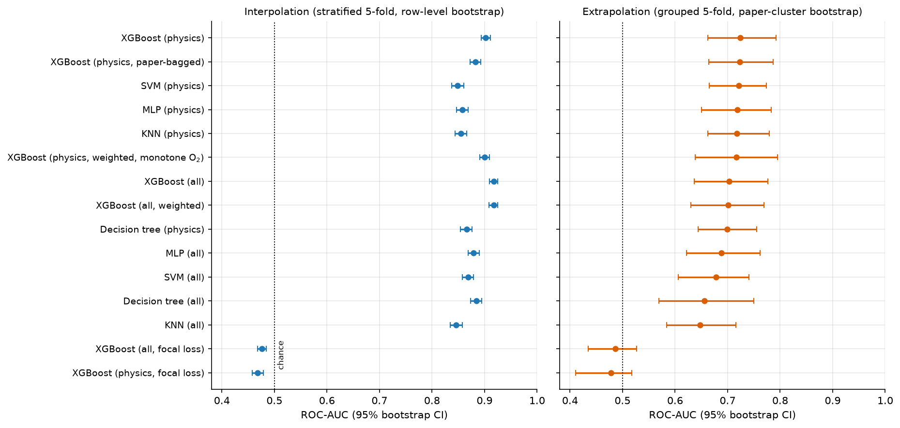

*Figure 4 — 95% bootstrap confidence intervals for ROC-AUC (2,000 iterations), ordered by extrapolation performance. Interpolation CIs (left, row-level resampling) are narrow; extrapolation CIs (right, paper-cluster resampling) are wide and heavily overlapping among the top ~8 candidates — a caution against over-interpreting small leaderboard gaps.*

**Statistical comparisons.** Paired Wilcoxon signed-rank tests over the 15 identical extrapolation folds (exploratory; unadjusted for multiplicity) show the champion significantly outperforms both decision trees (p ≤ 0.0009), `knn_all` (p = 0.0003), `svm_all` (p = 0.0009), `svm_physics` (p = 0.048), and both focal variants (p = 0.00006) — but is *not* statistically separable from `knn_physics` (p = 0.30), the monotone-O₂ variant (p = 0.60), paper bagging (p = 0.28), or `xgb_all_unweighted` (p = 0.09). The honest claim is therefore that a *cluster of physics-informed models* achieves ROC-AUC ≈ 0.70–0.72 on unseen campaigns, with the champion selected from that cluster by the pre-declared tie-breaking policy.

### 4.4 The generalization gap

Comparing each candidate's interpolation and extrapolation scores quantifies how much of its apparent skill is campaign-specific:

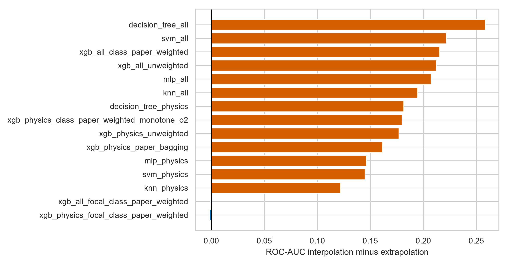

*Figure 5 — ROC-AUC drop from interpolation to extrapolation per candidate. Models using the `all` feature set (top of the chart) lose 0.19–0.26; physics-only models lose 0.12–0.18. The focal variants show no drop only because they never left chance.*

Two conclusions:

1. **Every legitimate model loses 0.12–0.26 ROC-AUC when papers are held out.** Row-level scores substantially overstate readiness for new campaigns; any deployment claim must cite the grouped numbers.
2. **Apparatus features are a liability for transfer.** `decision_tree_all` suffers the largest drop (0.258) and `xgb_all_unweighted` drops 0.212, versus 0.177 for its physics twin. Apparatus descriptors act as soft paper identifiers: they help models memorize campaigns, which inflates interpolation and deflates extrapolation. This is direct, quantified evidence for the physics-only design choice in the extrapolation champion.

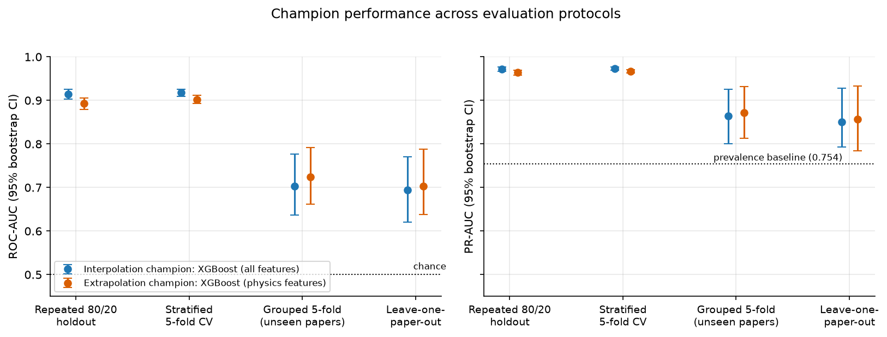

*Figure 6 — Both champions evaluated across all four protocols (95% bootstrap CIs). The step down from row-level protocols to paper-grouped protocols is the central empirical fact of this study. PR-AUC stays well above the 0.754 prevalence baseline under every protocol.*

### 4.5 Paper-by-paper robustness (LOPO)

Leave-one-paper-out answers the sharpest question: *for each individual paper, how well does a model trained on the other 84 papers predict it?*

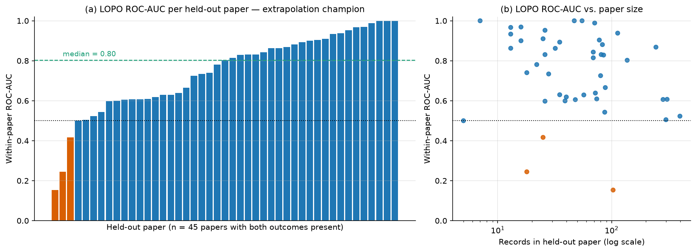

*Figure 7 — (a) Within-paper ROC-AUC of the extrapolation champion for each of the 45 held-out papers containing both outcome classes (the other 40 papers are single-class, so ROC-AUC is undefined for them). Median 0.80; 12 papers exceed 0.90; 3 fall below chance (orange). (b) The failures are not simply the small papers — poor transfer reflects campaign idiosyncrasy rather than test-set size.*

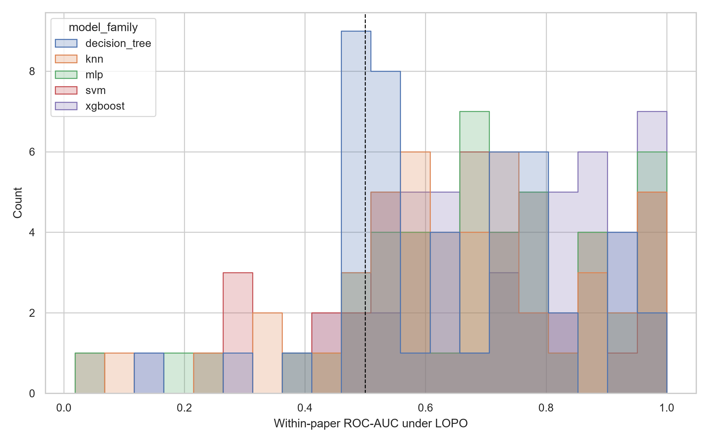

*Figure 8 — Distribution of within-paper LOPO ROC-AUC across model families. All families show the same qualitative shape — most papers predictable, a minority poorly transferred — with XGBoost (purple) shifted rightward.*

Interpretation: extrapolation skill is real but **uneven**. For roughly a quarter of evaluable papers the champion is near-perfect (ROC-AUC > 0.9); for a small minority it fails outright. The pooled LOPO ROC-AUC of the champion (0.704, CI [0.638, 0.789]) is statistically consistent with the grouped 5-fold estimate, which cross-validates the headline extrapolation number under an entirely different splitting scheme.

### 4.6 Operating points

Pooled outer-fold confusion statistics for the champions at each frozen threshold:

| Champion | Threshold policy | Mean threshold | Sensitivity | Specificity | Precision |
|---|---|---:|---:|---:|---:|
| Interpolation (`xgb_all_unweighted`) | MCC | 0.806 | 0.798 | 0.884 | 0.955 |
| | F1 | 0.385 | 0.936 | 0.534 | 0.860 |
| | Balanced accuracy / Youden J | 0.877 | 0.761 | 0.934 | 0.973 |
| Extrapolation (`xgb_physics_unweighted`) | MCC | 0.781 | 0.739 | 0.577 | 0.843 |
| | F1 | 0.206 | 0.983 | 0.047 | 0.760 |
| | Balanced accuracy / Youden J | 0.843 | 0.631 | 0.684 | 0.860 |

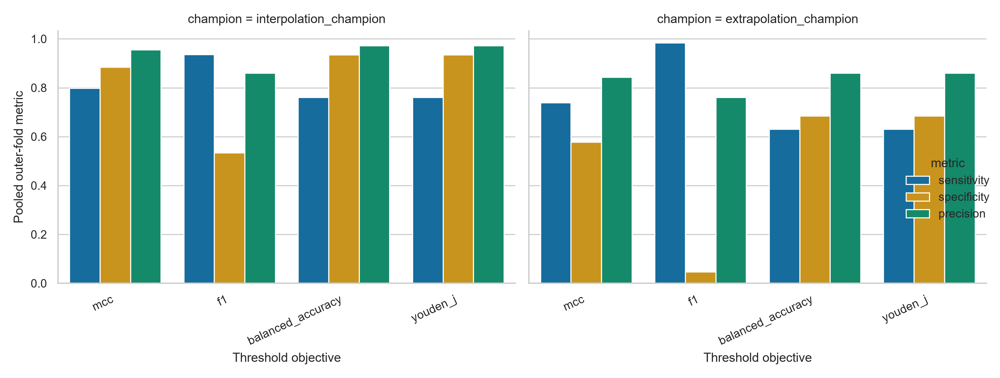

*Figure 9 — Sensitivity / specificity / precision of each champion at the four frozen decision thresholds.*

The table makes the cost trade-offs concrete. Under extrapolation, the F1-optimal threshold is operationally useless (it labels nearly everything "ignition": 98% sensitivity, 5% specificity) — an expected pathology of F1 optimization at 75% prevalence, and precisely why no single threshold was crowned. For fire-safety screening where *missing a flammable case* is the costly error, the F1-style permissive threshold is actually the conservative choice; for balanced scientific characterization, the MCC or balanced-accuracy thresholds are appropriate.

### 4.7 Calibration

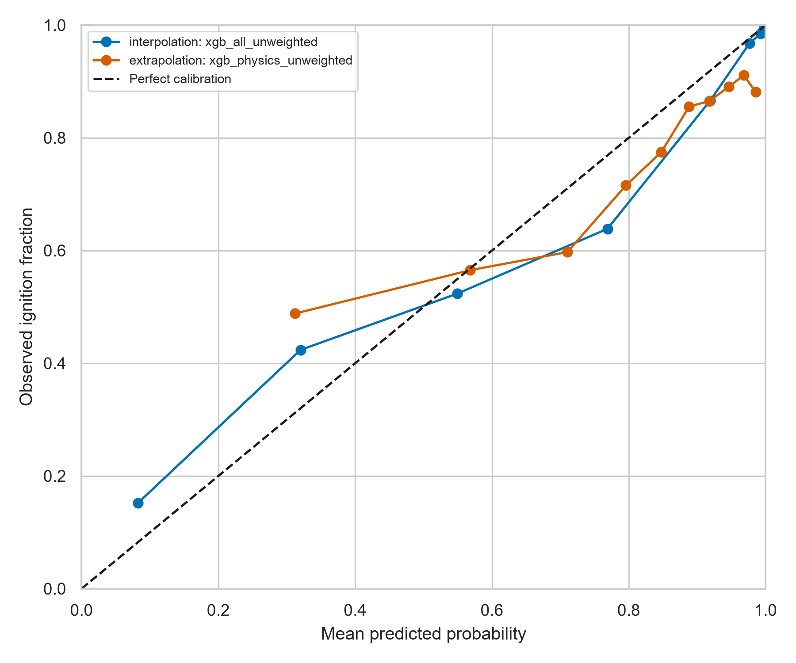

*Figure 10 — Reliability diagram of pooled outer-fold predictions. Both champions are reasonably calibrated at the extremes but over-confident in the mid-range: conditions predicted at ~35% ignition probability actually ignite ~45–49% of the time. Predicted probabilities near 0 or 1 can be taken at face value; mid-range probabilities should be read as "uncertain" rather than literal frequencies.*

The interpolation champion's Brier score (0.105) is roughly what an ideal-calibration model with this discrimination would achieve; the extrapolation champion's higher Brier (0.173) reflects both the harder task and the mid-range over-confidence. Post-hoc recalibration (e.g., isotonic regression on out-of-fold predictions) is an easy future refinement if downstream users need literal probabilities.

### 4.8 What drives the predictions? (Explainability)

SHAP values were computed for the extrapolation champion on held-out papers (837 rows from 17 papers never used in training that model), so the attributions reflect transfer-relevant behavior rather than memorization.

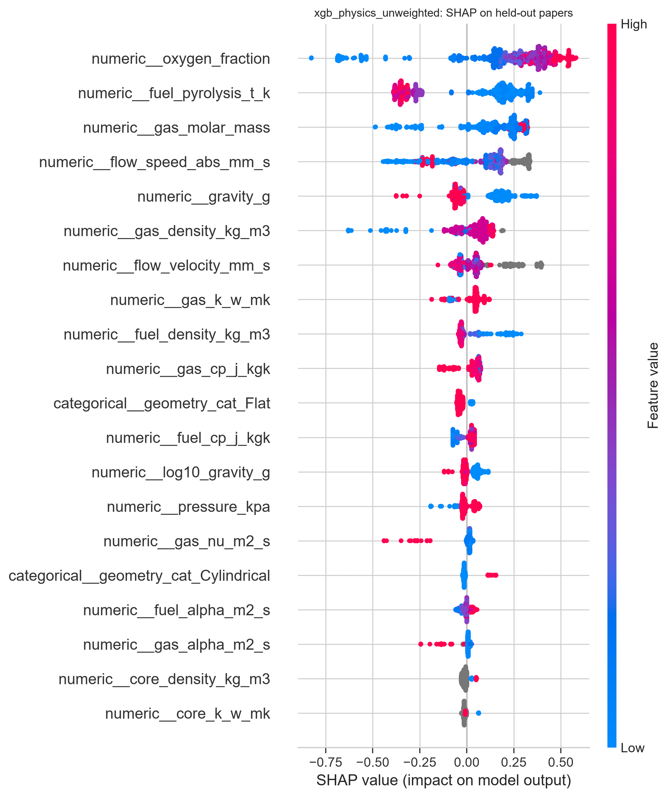

*Figure 11 — SHAP beeswarm for the extrapolation champion on held-out papers. Each dot is one record; horizontal position is the feature's push toward "ignition" (right) or "no ignition" (left); color encodes the feature's value (red = high, blue = low).*

| Rank | Feature | mean&#124;SHAP&#124; | Physical reading |
|---:|---|---:|---|
| 1 | `oxygen_fraction` | 0.325 | High O₂ pushes strongly toward ignition; low O₂ suppresses it — the textbook flammability driver |
| 2 | `fuel_pyrolysis_t_k` | 0.255 | High pyrolysis temperature (harder-to-gasify fuels) pushes against ignition |
| 3 | `gas_molar_mass` | 0.198 | Proxy for diluent identity/transport properties of the atmosphere |
| 4 | `flow_speed_abs_mm_s` | 0.172 | Moderate flow aids oxygen supply; the mixed signs echo the known non-monotonic blow-off/enhancement behavior |
| 5 | `gravity_g` | 0.119 | Low gravity increases predicted ignition propensity in this database, consistent with weakened buoyant heat losses |

The oxygen effect is *learned* monotone here (the explicitly constrained variant performed indistinguishably, p = 0.60 — the data alone already impose the physics). Permutation importance on the same held-out papers tells a complementary story: shuffling `fuel_pyrolysis_t_k` costs the most ROC-AUC (−0.162), followed by flow speed (−0.053), while shuffling `oxygen_fraction` costs almost nothing *despite* its top SHAP rank — because oxygen information is partially redundant with correlated gas-mixture features (`gas_molar_mass`, `gas_density_kg_m3`, `gas_cp_j_kgk`), which cover for it when it is scrambled. This SHAP/permutation disagreement is expected behavior under correlated features, not a contradiction; jointly, the two analyses identify the fuel's thermal decomposition threshold, the oxidizer environment, and convective transport as the load-bearing signals.

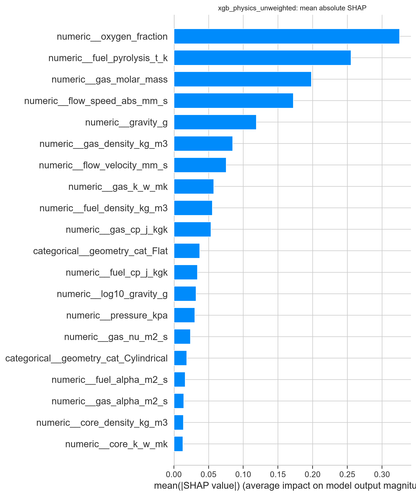

*Figure 12 — Mean absolute SHAP attribution per feature (held-out papers).*

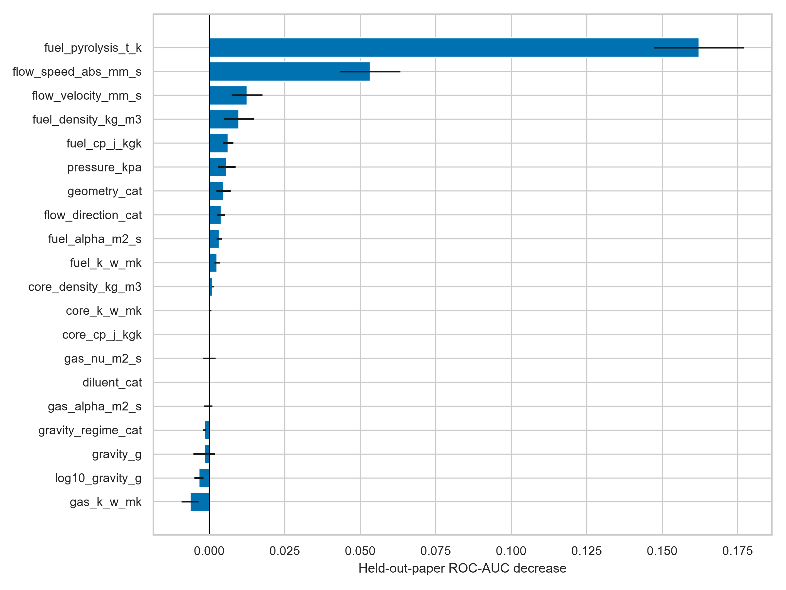

*Figure 13 — Permutation importance (held-out-paper ROC-AUC decrease, mean ± SD over repeats). Negative values for some sparse gas features indicate noise-level contributions.*

### 4.9 Champion configurations

Refit on all 4,499 records with the modal outer-fold hyperparameters:

| | Interpolation champion | Extrapolation champion |
|---|---|---|
| Model | XGBoost, `binary:logistic` | XGBoost, `binary:logistic` |
| Features | all (44) | physics (24) |
| `n_estimators` | 600 | 400 |
| `learning_rate` | 0.1 | 0.01 |
| `max_depth` | 6 | 4 |
| `min_child_weight` | 2 | 4 |
| `subsample` / `colsample_bytree` | 0.8 / 0.6 | 0.8 / 0.6 |
| `reg_lambda` / `reg_alpha` / `gamma` | 5.0 / 0.5 / 0.0 | 5.0 / 0.0 / 0.0 |
| Deployment thresholds (MCC / F1 / BA) | 0.764 / 0.392 / 0.870 | 0.798 / 0.355 / 0.802 |

The contrast is meaningful: the extrapolation champion's tuning independently converged on a *more conservative* model — shallower trees, slower learning rate, fewer boosting rounds, stronger minimum-child regularization — exactly the bias-variance trade-off one expects when the deployment distribution differs from training.

### 4.10 Negative results

Reported deliberately, because they save future effort:

1. **Focal loss failed catastrophically** (ROC-AUC ≈ 0.49, Brier ≈ 0.74–0.76 under all protocols — chance-level ranking with badly scaled probability outputs). At a mild 3:1 imbalance, down-weighting easy examples appears to destroy more signal than it recovers; the custom-objective raw scores also never achieve usable calibration. Both focal candidates were eligible under the policy but ranked last everywhere.
2. **Class/paper weighting bought nothing.** The weighted XGBoost variants are within noise of their unweighted twins under both questions (Δ ROC-AUC ≤ 0.003 interpolation, ≤ 0.006 extrapolation, n.s.). Threshold tuning already absorbs the imbalance; reweighting the loss was redundant.
3. **Paper bagging and the monotone-O₂ constraint did not measurably improve extrapolation** (p = 0.28 and p = 0.60 vs. champion) — though both are statistically tied with the champion, so they remain reasonable alternatives if ensemble variance reduction or guaranteed physical monotonicity is desired for its own sake.
4. **Apparatus features actively hurt transfer** (Section 4.4) — the clearest actionable finding for future database curation: invest in completing physics fields, not apparatus metadata.

---

## 5. Discussion

**What the numbers mean.** Within campaigns similar to the database, ignition outcome is highly predictable (ROC-AUC 0.914): the aggregated literature contains a consistent, learnable mapping from environmental/material conditions to ignition. Across campaigns, a genuine but noisier signal transfers (ROC-AUC 0.72, median within-paper 0.80): the physics common to all campaigns — oxygen availability, fuel decomposition threshold, convective supply, gravity — carries substantial predictive information, but campaign-specific factors that the features do not capture (igniter details, sample conditioning, operational ignition criteria, unreported procedure differences) impose a hard ceiling.

**Why the gap is a finding, not a flaw.** The 0.19 ROC-AUC gap between the two questions for the same model family is an *estimate of campaign heterogeneity itself*. Studies that report only row-level cross-validation on clustered scientific databases implicitly publish the 0.91-type number while implying the 0.72-type claim; the design here makes the distinction explicit and measures it.

**Physics consistency as validation.** The model's learned structure — monotone oxygen response, suppressive high pyrolysis temperature, non-monotonic flow effect, elevated ignition propensity at low gravity — reproduces known flammability behavior without being told any of it (the one constrained variant performed identically). This convergence between data-driven attribution and domain theory is the strongest available evidence that the extrapolation champion generalizes for the right reasons.

**Practical guidance.** Use the interpolation champion to interpolate within the tested envelope (e.g., filling parameter-sweep gaps in known campaigns). Use the extrapolation champion — with its wider uncertainty honestly attached — for triage of genuinely new configurations, at a threshold chosen for the application's error costs (permissive/F1-style for safety screening, MCC for balanced accuracy). Treat mid-range probabilities as "uncertain" pending recalibration.

---

## 6. Limitations

1. **Observational, literature-aggregated data.** Records are not a designed experiment; papers studied the conditions they chose. Associations here are predictive, not causal.
2. **Prevalence is not a field ignition rate.** The 75.4% ignition share reflects publication and experiment-design choices; deployment populations may differ, which affects PR-AUC and threshold behavior.
3. **Extrapolation estimates are bounded by database coverage.** "Unseen paper" means unseen *within this literature*; truly novel materials, geometries, or environments beyond the database envelope carry additional, unquantified risk.
4. **Label heterogeneity.** "Ignition" criteria vary subtly across laboratories; some within-paper LOPO failures likely reflect definitional mismatch rather than model error.
5. **40 of 85 papers are single-class**, capping the resolution of per-paper analysis and making paper-grouped stratification imperfect.
6. **Missingness is severe for apparatus features** and non-trivial for substrate properties; imputation is fold-safe but cannot create absent information.
7. **Statistical tests are exploratory** (15 paired folds, unadjusted multiplicity); the wide, overlapping extrapolation CIs are the more trustworthy summary of model separability.
8. **Calibration is imperfect in the mid-probability range** (Section 4.7); probabilities near 0.3–0.6 should not be read as literal frequencies without recalibration.

---

## 7. Reproducibility

Everything is deterministic given the dataset file and seed 42 (repeated splits use consecutive seeds 42–44). Split files store the dataset SHA-256, exact row/paper memberships, and integrity fingerprints; the evaluation persists every sampled configuration, search history, and outer prediction; models embed data fingerprints in their model cards.

```bash
cd "Ignition Classifiers"
python -m venv .venv && source .venv/bin/activate
python -m pip install -r requirements.txt

python fable_splits.py   --data ../Microgravity_Database_reduced.csv --out results/splits --n-seeds 3 --n-group-folds 5 --n-row-folds 5
python fable_evaluate.py --data ../Microgravity_Database_reduced.csv --splits results/splits --config configs/candidates.yaml --out results/evaluation --search-iterations 40 --inner-group-folds 3
python fable_select.py   --evaluation results/evaluation --policy configs/selection_policy.yaml --out results/selection.json
python fable_refit.py    --data ../Microgravity_Database_reduced.csv --selection results/selection.json --champion interpolation --out artifacts/interpolation_champion
python fable_refit.py    --data ../Microgravity_Database_reduced.csv --selection results/selection.json --champion extrapolation --out artifacts/extrapolation_champion
python fable_report.py   --data ../Microgravity_Database_reduced.csv --evaluation results/evaluation --selection results/selection.json --artifacts artifacts --out results/report

# Supplementary figures for this document (reads persisted results only):
python make_paper_figures.py
```

Evaluation artifacts are unbiased comparison evidence, not trained production models; refit artifacts are trained production models, not unbiased evaluation evidence. Interpolation results must never be presented as unseen-paper generalization.

---

## 8. Using the trained models

```bash
python fable_predict.py \
  --input ../new_conditions.csv \
  --output predictions.csv \
  --champion extrapolation   # or: interpolation
```

The output contains, per input row: the class-1 (ignition) probability, all four threshold decisions, derivable paper identity, and model/data fingerprints. Choose the champion by question (Section 3.1) and the threshold column by error-cost structure (Section 4.6).

---

## Appendix A — Glossary of terms

| Term | Meaning |
|---|---|
| **ROC-AUC** | Probability that the model ranks a random ignition case above a random non-ignition case. 1.0 = perfect ranking, 0.5 = coin flip. Threshold-independent. |
| **PR-AUC** | Area under the precision-recall curve. Under class imbalance, its no-skill baseline equals the positive prevalence (0.754 here), not 0.5. |
| **Brier score** | Mean squared difference between predicted probability and actual outcome (0/1). Lower is better; rewards calibrated confidence. |
| **MCC** | Matthews correlation coefficient; a balanced single-number summary of the confusion matrix, robust to imbalance (−1 to +1). |
| **Sensitivity / specificity** | Fraction of true ignitions caught / fraction of true non-ignitions correctly cleared. |
| **Precision** | Of the cases the model calls "ignition", the fraction that truly ignite. |
| **Stratified k-fold CV** | Split rows into k equal parts preserving class ratio; each part takes a turn as the test set. |
| **StratifiedGroupKFold** | Same, but entire groups (papers) are kept intact within one fold — no paper spans train and test. |
| **LOPO** | Leave-One-Paper-Out: train on 84 papers, test on the held-out one; repeat for all 85. |
| **Nested tuning** | Hyperparameters are chosen with an inner CV *inside* each outer training fold, so the outer test fold never influences tuning. |
| **Data leakage** | Any pathway by which test-set information contaminates training decisions, inflating scores. |
| **Bootstrap CI** | Uncertainty interval from re-computing the metric on thousands of resampled datasets; here resampling whole paper clusters when papers are the inference unit. |
| **SHAP** | Game-theoretic attribution of each prediction to each feature (how much the feature pushed the output up or down). |
| **Permutation importance** | Performance loss when one feature's values are shuffled; measures unique (non-redundant) contribution. |
| **Calibration** | Agreement between predicted probability and observed frequency (a calibrated "0.7" ignites 70% of the time). |
| **Focal loss** | A modified training loss that focuses on hard examples; designed for extreme imbalance. |
| **Champion** | The candidate selected by the pre-declared policy for a given scientific question. |

## Appendix B — Hyperparameter search spaces

40 configurations were sampled per outer training fold from these grids (identical across protocols; `fable_models.py`):

| Family | Search space |
|---|---|
| XGBoost | `n_estimators` ∈ {200, 400, 600, 800}; `learning_rate` ∈ {0.01, 0.03, 0.05, 0.1}; `max_depth` ∈ {2–6}; `min_child_weight` ∈ {1, 2, 4, 8}; `subsample`, `colsample_bytree` ∈ {0.6, 0.8, 1.0}; `reg_lambda` ∈ {0.5, 1, 2, 5}; `reg_alpha` ∈ {0, 0.1, 0.5}; `gamma` ∈ {0, 0.1, 0.5} |
| KNN | `n_neighbors` ∈ {5, 9, 15, 25, 40, 60}; `weights` ∈ {uniform, distance}; `p` ∈ {1, 2}; `leaf_size` ∈ {15, 30, 60} |
| Decision tree | `max_depth` ∈ {3, 5, 7, 10, ∞}; `min_samples_leaf` ∈ {1, 2, 5, 10, 20}; `criterion` ∈ {gini, entropy, log_loss} |
| MLP | `hidden_layer_sizes` ∈ {(32), (64), (64, 32), (128, 64)}; `alpha` ∈ {1e-5 … 1e-2}; `learning_rate_init` ∈ {1e-4 … 3e-3}; `activation` ∈ {relu, tanh}; `batch_size` ∈ {32, 64, 128}; early stopping, ≤ 600 iterations |
| SVM (RBF) | `C` ∈ {0.1, 0.3, 1, 3, 10, 30}; `gamma` ∈ {scale, 0.01, 0.03, 0.1, 0.3}; `shrinking` ∈ {true, false}; sigmoid-calibrated (3-fold) |

## Appendix C — Output artifact map

| Artifact | Contents |
|---|---|
| `results/splits/` | Exact split memberships, dataset fingerprint, integrity report, data-validation report |
| `results/evaluation/summary_metrics.csv` | All candidate × protocol metric means/SDs |
| `results/evaluation/fold_metrics.csv` | Per-fold metrics (basis of all dispersion estimates) |
| `results/evaluation/bootstrap_intervals.csv` | 95% CIs, 2,000 iterations, cluster-aware |
| `results/evaluation/paired_model_comparisons.csv` | Paired Wilcoxon tests over identical folds |
| `results/evaluation/per_paper_metrics.csv` | Within-paper metrics for every protocol |
| `results/evaluation/search_history.csv`, `selected_hyperparameters.csv` | Complete nested-search audit trail |
| `results/selection.json` / `selection.md` | Machine- and human-readable champion decisions |
| `results/report/` | All tables (CSV + Markdown) and figures (PNG) referenced above |
| `results/report/paper_figures/` | Supplementary figures generated by `make_paper_figures.py` |
| `artifacts/{interpolation,extrapolation}_champion/` | Deployable models, model cards, thresholds, OOF predictions |
